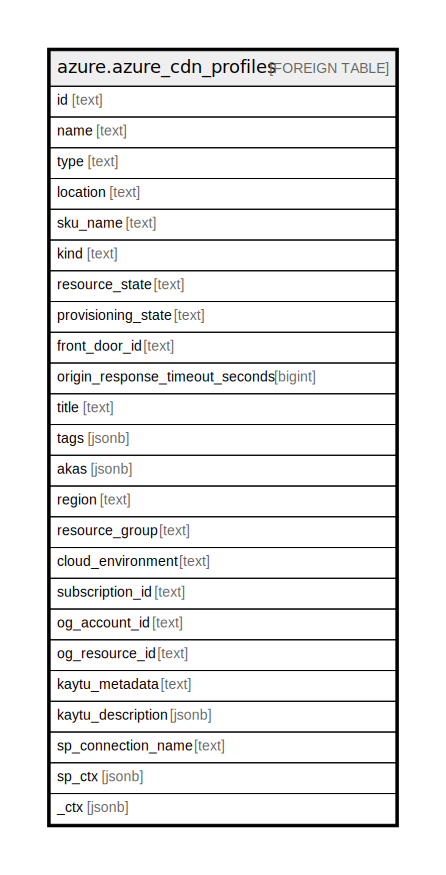

# azure.azure_cdn_profiles

## Description

Azure Cdn Profiles

## Columns

| Name | Type | Default | Nullable | Children | Parents | Comment |
| ---- | ---- | ------- | -------- | -------- | ------- | ------- |
| id | text |  | true |  |  | The id of the profiles. |
| name | text |  | true |  |  | The name of the profiles. |
| type | text |  | true |  |  | The resource type. |
| location | text |  | true |  |  | The location of the CDN front door profile. |
| sku_name | text |  | true |  |  | Name of the pricing tier. |
| kind | text |  | true |  |  | Kind of the profile. Used by portal to differentiate traditional CDN profile and new AFD profile. |
| resource_state | text |  | true |  |  | Resource status of the CDN front door profile. |
| provisioning_state | text |  | true |  |  | Provisioning status of the CDN front door profile. |
| front_door_id | text |  | true |  |  | The ID of the front door. |
| origin_response_timeout_seconds | bigint |  | true |  |  | Send and receive timeout on forwarding request to the origin. When timeout is reached, the request fails and returns. |
| title | text |  | true |  |  | Title of the resource. |
| tags | jsonb |  | true |  |  | A map of tags for the resource. |
| akas | jsonb |  | true |  |  | Array of globally unique identifier strings (also known as) for the resource. |
| region | text |  | true |  |  | The Azure region where the resource is located. |
| resource_group | text |  | true |  |  | The resource group in which the resource is located. |
| cloud_environment | text |  | true |  |  | The Azure Cloud Environment. |
| subscription_id | text |  | true |  |  | The Azure Subscription ID in which the resource is located. |
| og_account_id | text |  | true |  |  | The Platform Account ID in which the resource is located. |
| og_resource_id | text |  | true |  |  | The unique ID of the resource in opengovernance. |
| kaytu_metadata | text |  | true |  |  | Platform Metadata of the Azure resource. |
| kaytu_description | jsonb |  | true |  |  | The full model description of the resource |
| sp_connection_name | text |  | true |  |  | Steampipe connection name. |
| sp_ctx | jsonb |  | true |  |  | Steampipe context in JSON form. |
| _ctx | jsonb |  | true |  |  | Steampipe context in JSON form. |

## Relations

---

> Generated by [tbls](https://github.com/k1LoW/tbls)
