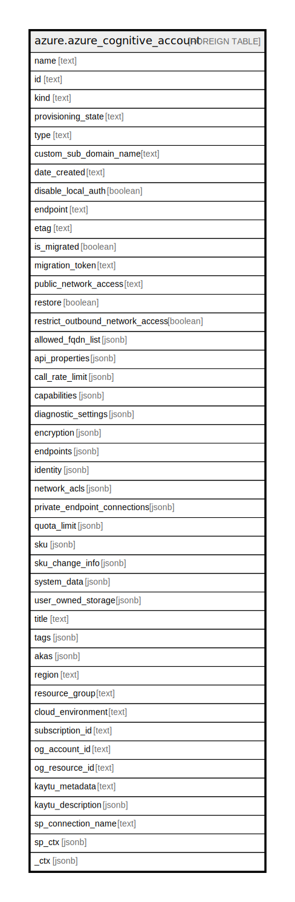

# azure.azure_cognitive_account

## Description

Azure Cognitive Account

## Columns

| Name | Type | Default | Nullable | Children | Parents | Comment |
| ---- | ---- | ------- | -------- | -------- | ------- | ------- |
| name | text |  | true |  |  | The name of the resource. |
| id | text |  | true |  |  | Fully qualified resource ID for the resource. |
| kind | text |  | true |  |  | The kind of the resource. |
| provisioning_state | text |  | true |  |  | The status of the cognitive services account at the time the operation was called. Possible values include: 'Accepted', 'Creating', 'Deleting', 'Moving', 'Failed', 'Succeeded', 'ResolvingDNS'. |
| type | text |  | true |  |  | The type of the resource. E.g. 'Microsoft.Compute/virtualMachines' or 'Microsoft.Storage/storageAccounts'. |
| custom_sub_domain_name | text |  | true |  |  | The subdomain name used for token-based authentication. |
| date_created | text |  | true |  |  | The date of cognitive services account creation. |
| disable_local_auth | boolean |  | true |  |  | Checks if local auth is disabled for the resource. |
| endpoint | text |  | true |  |  | The endpoint of the created account. |
| etag | text |  | true |  |  | The resource etag. |
| is_migrated | boolean |  | true |  |  | Checks if the resource is migrated from an existing key. |
| migration_token | text |  | true |  |  | The resource migration token. |
| public_network_access | text |  | true |  |  | Whether or not public endpoint access is allowed for this account. Value is optional but if passed in, must be 'Enabled' or 'Disabled'. Possible values include: 'Enabled', 'Disabled'. |
| restore | boolean |  | true |  |  | Checks if restore is enabled for the resource. |
| restrict_outbound_network_access | boolean |  | true |  |  | Checks if outbound network access is restricted for the resource. |
| allowed_fqdn_list | jsonb |  | true |  |  | The allowed FQDN list for the resource. |
| api_properties | jsonb |  | true |  |  | The api properties for special APIs. |
| call_rate_limit | jsonb |  | true |  |  | The call rate limit of the resource. |
| capabilities | jsonb |  | true |  |  | The capabilities of the cognitive services account. Each item indicates the capability of a specific feature. The values are read-only and for reference only. |
| diagnostic_settings | jsonb |  | true |  |  | A list of active diagnostic settings for the cognitive service account. |
| encryption | jsonb |  | true |  |  | The encryption properties for the resource. |
| endpoints | jsonb |  | true |  |  | All endpoints of the cognitive services account. |
| identity | jsonb |  | true |  |  | The identity for the resource. |
| network_acls | jsonb |  | true |  |  | A collection of rules governing the accessibility from specific network locations. |
| private_endpoint_connections | jsonb |  | true |  |  | The private endpoint connection associated with the cognitive services account. |
| quota_limit | jsonb |  | true |  |  | The quota limit of the resource. |
| sku | jsonb |  | true |  |  | The resource model definition representing SKU. |
| sku_change_info | jsonb |  | true |  |  | Sku change info of the resource. |
| system_data | jsonb |  | true |  |  | The metadata pertaining to creation and last modification of the resource. |
| user_owned_storage | jsonb |  | true |  |  | The storage accounts for the resource. |
| title | text |  | true |  |  | Title of the resource. |
| tags | jsonb |  | true |  |  | A map of tags for the resource. |
| akas | jsonb |  | true |  |  | Array of globally unique identifier strings (also known as) for the resource. |
| region | text |  | true |  |  | The Azure region/location in which the resource is located. |
| resource_group | text |  | true |  |  | The resource group which holds this resource. |
| cloud_environment | text |  | true |  |  | The Azure Cloud Environment. |
| subscription_id | text |  | true |  |  | The Azure Subscription ID in which the resource is located. |
| og_account_id | text |  | true |  |  | The Platform Account ID in which the resource is located. |
| og_resource_id | text |  | true |  |  | The unique ID of the resource in opengovernance. |
| kaytu_metadata | text |  | true |  |  | Platform Metadata of the Azure resource. |
| kaytu_description | jsonb |  | true |  |  | The full model description of the resource |
| sp_connection_name | text |  | true |  |  | Steampipe connection name. |
| sp_ctx | jsonb |  | true |  |  | Steampipe context in JSON form. |
| _ctx | jsonb |  | true |  |  | Steampipe context in JSON form. |

## Relations

---

> Generated by [tbls](https://github.com/k1LoW/tbls)
