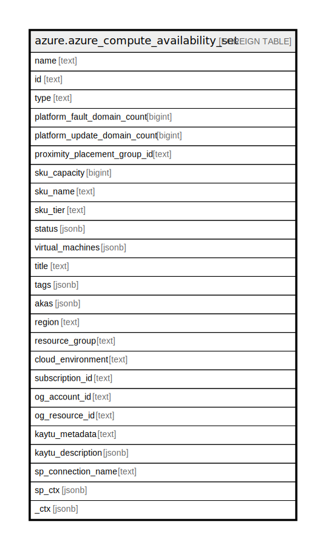

# azure.azure_compute_availability_set

## Description

Azure Compute Availability Set

## Columns

| Name | Type | Default | Nullable | Children | Parents | Comment |
| ---- | ---- | ------- | -------- | -------- | ------- | ------- |
| name | text |  | true |  |  | The friendly name that identifies the availability set |
| id | text |  | true |  |  | The unique id identifying the resource in subscription |
| type | text |  | true |  |  | The type of the resource in Azure |
| platform_fault_domain_count | bigint |  | true |  |  | Contains the fault domain count |
| platform_update_domain_count | bigint |  | true |  |  | Contains the update domain count |
| proximity_placement_group_id | text |  | true |  |  | Specifies information about the proximity placement group that the availability set should be assigned to |
| sku_capacity | bigint |  | true |  |  | Specifies the number of virtual machines in the scale set |
| sku_name | text |  | true |  |  | The availability sets sku name |
| sku_tier | text |  | true |  |  | Specifies the tier of virtual machines in a scale set |
| status | jsonb |  | true |  |  | The resource status information |
| virtual_machines | jsonb |  | true |  |  | A list of references to all virtual machines in the availability set |
| title | text |  | true |  |  | Title of the resource. |
| tags | jsonb |  | true |  |  | A map of tags for the resource. |
| akas | jsonb |  | true |  |  | Array of globally unique identifier strings (also known as) for the resource. |
| region | text |  | true |  |  | The Azure region/location in which the resource is located. |
| resource_group | text |  | true |  |  | The resource group which holds this resource. |
| cloud_environment | text |  | true |  |  | The Azure Cloud Environment. |
| subscription_id | text |  | true |  |  | The Azure Subscription ID in which the resource is located. |
| og_account_id | text |  | true |  |  | The Platform Account ID in which the resource is located. |
| og_resource_id | text |  | true |  |  | The unique ID of the resource in opengovernance. |
| kaytu_metadata | text |  | true |  |  | Platform Metadata of the Azure resource. |
| kaytu_description | jsonb |  | true |  |  | The full model description of the resource |
| sp_connection_name | text |  | true |  |  | Steampipe connection name. |
| sp_ctx | jsonb |  | true |  |  | Steampipe context in JSON form. |
| _ctx | jsonb |  | true |  |  | Steampipe context in JSON form. |

## Relations

---

> Generated by [tbls](https://github.com/k1LoW/tbls)
