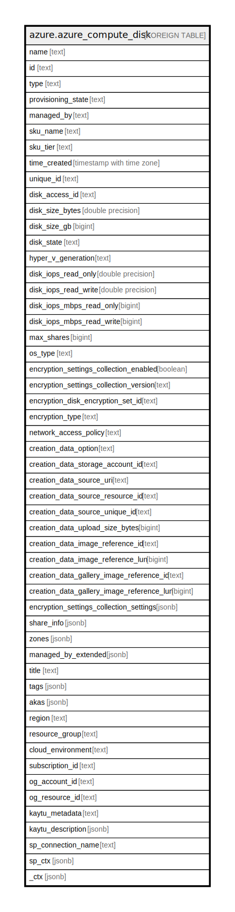

# azure.azure_compute_disk

## Description

Azure Compute Disk

## Columns

| Name | Type | Default | Nullable | Children | Parents | Comment |
| ---- | ---- | ------- | -------- | -------- | ------- | ------- |
| name | text |  | true |  |  | Name of the disk |
| id | text |  | true |  |  | The unique id identifying the resource in subscription |
| type | text |  | true |  |  | The type of the resource in Azure |
| provisioning_state | text |  | true |  |  | The disk provisioning state |
| managed_by | text |  | true |  |  | A relative URI containing the ID of the VM that has the disk attached |
| sku_name | text |  | true |  |  | The disks sku name. Can be Standard_LRS, Premium_LRS, StandardSSD_LRS, or UltraSSD_LRS |
| sku_tier | text |  | true |  |  | The sku tier |
| time_created | timestamp with time zone |  | true |  |  | The time when the disk was created |
| unique_id | text |  | true |  |  | Unique Guid identifying the resource |
| disk_access_id | text |  | true |  |  | ARM id of the DiskAccess resource for using private endpoints on disks |
| disk_size_bytes | double precision |  | true |  |  | The size of the disk in bytes |
| disk_size_gb | bigint |  | true |  |  | If this field is present for updates or creation with other options, it indicates a resize. Resizes are only allowed if the disk is not attached to a running VM, and can only increase the disk's size |
| disk_state | text |  | true |  |  | This enumerates the possible state of the disk |
| hyper_v_generation | text |  | true |  |  | The hypervisor generation of the Virtual Machine. Applicable to OS disks only |
| disk_iops_read_only | double precision |  | true |  |  | The total number of IOPS that will be allowed across all VMs mounting the shared disk as ReadOnly. One operation can transfer between 4k and 256k bytes |
| disk_iops_read_write | double precision |  | true |  |  | The number of IOPS allowed for this disk; only settable for UltraSSD disks. One operation can transfer between 4k and 256k bytes |
| disk_iops_mbps_read_only | bigint |  | true |  |  | The total throughput (MBps) that will be allowed across all VMs mounting the shared disk as ReadOnly. MBps means millions of bytes per second - MB here uses the ISO notation, of powers of 10 |
| disk_iops_mbps_read_write | bigint |  | true |  |  | The bandwidth allowed for this disk; only settable for UltraSSD disks. MBps means millions of bytes per second - MB here uses the ISO notation, of powers of 10 |
| max_shares | bigint |  | true |  |  | The maximum number of VMs that can attach to the disk at the same time. Value greater than one indicates a disk that can be mounted on multiple VMs at the same time |
| os_type | text |  | true |  |  | The Operating System type |
| encryption_settings_collection_enabled | boolean |  | true |  |  | Shows the status of the encryption settings for the disk |
| encryption_settings_collection_version | text |  | true |  |  | Describes the type of encryption is used for the disks. '1.0' corresponds to Azure Disk Encryption with AAD app. '1.1' corresponds to Azure Disk Encryption |
| encryption_disk_encryption_set_id | text |  | true |  |  | ResourceId of the disk encryption set to use for enabling encryption at rest |
| encryption_type | text |  | true |  |  | The type of key used to encrypt the data of the disk |
| network_access_policy | text |  | true |  |  | Policy for accessing the disk via network |
| creation_data_option | text |  | true |  |  | This enumerates the possible sources of a disk's creation |
| creation_data_storage_account_id | text |  | true |  |  | The Azure Resource Manager identifier of the storage account containing the blob to import as a disk |
| creation_data_source_uri | text |  | true |  |  | The URI of a blob to be imported into a managed disk |
| creation_data_source_resource_id | text |  | true |  |  | The ARM id of the source snapshot or disk |
| creation_data_source_unique_id | text |  | true |  |  | An unique id identifying the source of this resource |
| creation_data_upload_size_bytes | bigint |  | true |  |  | This is the size of the contents of the upload including the VHD footer. This value should be between 20972032 (20 MiB + 512 bytes for the VHD footer) and 35183298347520 bytes (32 TiB + 512 bytes for the VHD footer) |
| creation_data_image_reference_id | text |  | true |  |  | A relative uri containing either a Platform Image Repository or user image reference |
| creation_data_image_reference_lun | bigint |  | true |  |  | If the disk is created from an image's data disk, this is an index that indicates which of the data disks in the image to use. For OS disks, this field is null |
| creation_data_gallery_image_reference_id | text |  | true |  |  | The ARM id of the shared galley image version from which disk was created |
| creation_data_gallery_image_reference_lun | bigint |  | true |  |  | An index that indicates which of the data disks in the image to use, if the disk is created from an image's data disk |
| encryption_settings_collection_settings | jsonb |  | true |  |  | A collection of encryption settings, one for each disk volume |
| share_info | jsonb |  | true |  |  | Details of the list of all VMs that have the disk attached |
| zones | jsonb |  | true |  |  | The Logical zone list for Disk |
| managed_by_extended | jsonb |  | true |  |  | List of relative URIs containing the IDs of the VMs that have the disk attached |
| title | text |  | true |  |  | Title of the resource. |
| tags | jsonb |  | true |  |  | A map of tags for the resource. |
| akas | jsonb |  | true |  |  | Array of globally unique identifier strings (also known as) for the resource. |
| region | text |  | true |  |  | The Azure region/location in which the resource is located. |
| resource_group | text |  | true |  |  | The resource group which holds this resource. |
| cloud_environment | text |  | true |  |  | The Azure Cloud Environment. |
| subscription_id | text |  | true |  |  | The Azure Subscription ID in which the resource is located. |
| og_account_id | text |  | true |  |  | The Platform Account ID in which the resource is located. |
| og_resource_id | text |  | true |  |  | The unique ID of the resource in opengovernance. |
| kaytu_metadata | text |  | true |  |  | Platform Metadata of the Azure resource. |
| kaytu_description | jsonb |  | true |  |  | The full model description of the resource |
| sp_connection_name | text |  | true |  |  | Steampipe connection name. |
| sp_ctx | jsonb |  | true |  |  | Steampipe context in JSON form. |
| _ctx | jsonb |  | true |  |  | Steampipe context in JSON form. |

## Relations

---

> Generated by [tbls](https://github.com/k1LoW/tbls)
