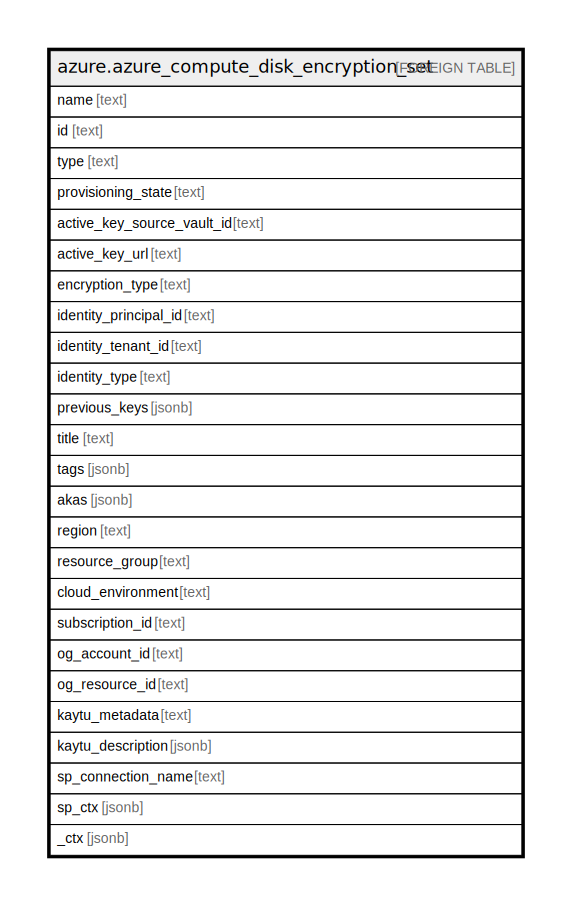

# azure.azure_compute_disk_encryption_set

## Description

Azure Compute Disk Encryption Set

## Columns

| Name | Type | Default | Nullable | Children | Parents | Comment |
| ---- | ---- | ------- | -------- | -------- | ------- | ------- |
| name | text |  | true |  |  | The friendly name that identifies the disk encryption set |
| id | text |  | true |  |  | The unique id identifying the resource in subscription |
| type | text |  | true |  |  | The type of the resource in Azure |
| provisioning_state | text |  | true |  |  | The disk encryption set provisioning state |
| active_key_source_vault_id | text |  | true |  |  | Resource id of the KeyVault containing the key or secret |
| active_key_url | text |  | true |  |  | Url pointing to a key or secret in KeyVault |
| encryption_type | text |  | true |  |  | Contains the type of the encryption |
| identity_principal_id | text |  | true |  |  | The object id of the Managed Identity Resource |
| identity_tenant_id | text |  | true |  |  | The tenant id of the Managed Identity Resource |
| identity_type | text |  | true |  |  | The type of Managed Identity used by the DiskEncryptionSet |
| previous_keys | jsonb |  | true |  |  | A list of key vault keys previously used by this disk encryption set while a key rotation is in progress |
| title | text |  | true |  |  | Title of the resource. |
| tags | jsonb |  | true |  |  | A map of tags for the resource. |
| akas | jsonb |  | true |  |  | Array of globally unique identifier strings (also known as) for the resource. |
| region | text |  | true |  |  | The Azure region/location in which the resource is located. |
| resource_group | text |  | true |  |  | The resource group which holds this resource. |
| cloud_environment | text |  | true |  |  | The Azure Cloud Environment. |
| subscription_id | text |  | true |  |  | The Azure Subscription ID in which the resource is located. |
| og_account_id | text |  | true |  |  | The Platform Account ID in which the resource is located. |
| og_resource_id | text |  | true |  |  | The unique ID of the resource in opengovernance. |
| kaytu_metadata | text |  | true |  |  | Platform Metadata of the Azure resource. |
| kaytu_description | jsonb |  | true |  |  | The full model description of the resource |
| sp_connection_name | text |  | true |  |  | Steampipe connection name. |
| sp_ctx | jsonb |  | true |  |  | Steampipe context in JSON form. |
| _ctx | jsonb |  | true |  |  | Steampipe context in JSON form. |

## Relations

---

> Generated by [tbls](https://github.com/k1LoW/tbls)
