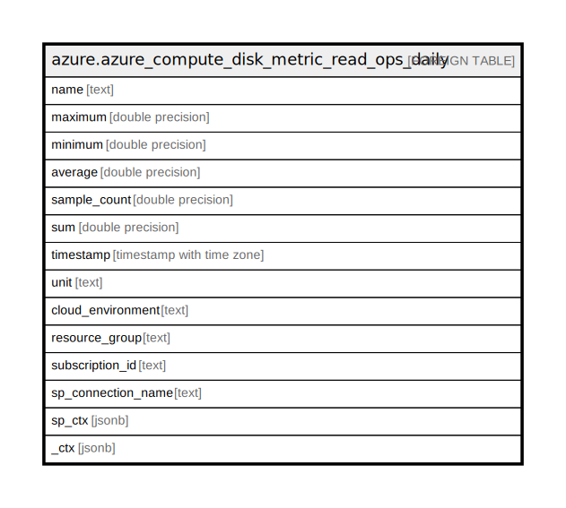

# azure.azure_compute_disk_metric_read_ops_daily

## Description

Azure Compute Disk Metrics - Read Ops (Daily)

## Columns

| Name | Type | Default | Nullable | Children | Parents | Comment |
| ---- | ---- | ------- | -------- | -------- | ------- | ------- |
| name | text |  | true |  |  | The name of the disk. |
| maximum | double precision |  | true |  |  | The maximum metric value for the data point. |
| minimum | double precision |  | true |  |  | The minimum metric value for the data point. |
| average | double precision |  | true |  |  | The average of the metric values that correspond to the data point. |
| sample_count | double precision |  | true |  |  | The number of metric values that contributed to the aggregate value of this data point. |
| sum | double precision |  | true |  |  | The sum of the metric values for the data point. |
| timestamp | timestamp with time zone |  | true |  |  | The time stamp used for the data point. |
| unit | text |  | true |  |  | The units in which the metric value is reported. |
| cloud_environment | text |  | true |  |  | The Azure Cloud Environment. |
| resource_group | text |  | true |  |  | The resource group which holds this resource. |
| subscription_id | text |  | true |  |  | The Azure Subscription ID in which the resource is located. |
| sp_connection_name | text |  | true |  |  | Steampipe connection name. |
| sp_ctx | jsonb |  | true |  |  | Steampipe context in JSON form. |
| _ctx | jsonb |  | true |  |  | Steampipe context in JSON form. |

## Relations

---

> Generated by [tbls](https://github.com/k1LoW/tbls)
