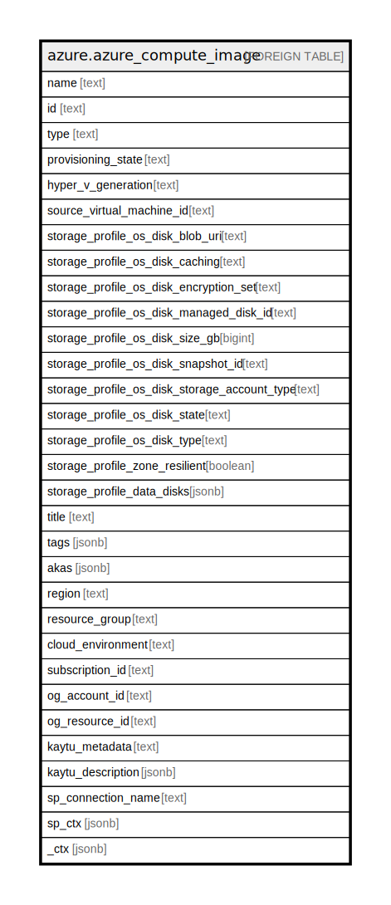

# azure.azure_compute_image

## Description

Azure Compute Image

## Columns

| Name | Type | Default | Nullable | Children | Parents | Comment |
| ---- | ---- | ------- | -------- | -------- | ------- | ------- |
| name | text |  | true |  |  | The friendly name that identifies the image |
| id | text |  | true |  |  | Contains ID to identify a image uniquely |
| type | text |  | true |  |  | Type of the resource |
| provisioning_state | text |  | true |  |  | The provisioning state of the image resource |
| hyper_v_generation | text |  | true |  |  | Gets the HyperVGenerationType of the VirtualMachine created from the image |
| source_virtual_machine_id | text |  | true |  |  | Contains the id of the virtual machine |
| storage_profile_os_disk_blob_uri | text |  | true |  |  | Contains uri of the virtual hard disk |
| storage_profile_os_disk_caching | text |  | true |  |  | Specifies the caching requirements |
| storage_profile_os_disk_encryption_set | text |  | true |  |  | Specifies the customer managed disk encryption set resource id for the managed image disk |
| storage_profile_os_disk_managed_disk_id | text |  | true |  |  | Contains the id of the managed disk |
| storage_profile_os_disk_size_gb | bigint |  | true |  |  | Specifies the size of empty data disks in gigabytes |
| storage_profile_os_disk_snapshot_id | text |  | true |  |  | Contains the id of the snapshot |
| storage_profile_os_disk_storage_account_type | text |  | true |  |  | Specifies the storage account type for the managed disk |
| storage_profile_os_disk_state | text |  | true |  |  | Contains state of the OS |
| storage_profile_os_disk_type | text |  | true |  |  | Specifies the type of the OS that is included in the disk if creating a VM from a custom image |
| storage_profile_zone_resilient | boolean |  | true |  |  | Specifies whether an image is zone resilient or not |
| storage_profile_data_disks | jsonb |  | true |  |  | A list of parameters that are used to add a data disk to a virtual machine |
| title | text |  | true |  |  | Title of the resource. |
| tags | jsonb |  | true |  |  | A map of tags for the resource. |
| akas | jsonb |  | true |  |  | Array of globally unique identifier strings (also known as) for the resource. |
| region | text |  | true |  |  | The Azure region/location in which the resource is located. |
| resource_group | text |  | true |  |  | The resource group which holds this resource. |
| cloud_environment | text |  | true |  |  | The Azure Cloud Environment. |
| subscription_id | text |  | true |  |  | The Azure Subscription ID in which the resource is located. |
| og_account_id | text |  | true |  |  | The Platform Account ID in which the resource is located. |
| og_resource_id | text |  | true |  |  | The unique ID of the resource in opengovernance. |
| kaytu_metadata | text |  | true |  |  | Platform Metadata of the Azure resource. |
| kaytu_description | jsonb |  | true |  |  | The full model description of the resource |
| sp_connection_name | text |  | true |  |  | Steampipe connection name. |
| sp_ctx | jsonb |  | true |  |  | Steampipe context in JSON form. |
| _ctx | jsonb |  | true |  |  | Steampipe context in JSON form. |

## Relations

---

> Generated by [tbls](https://github.com/k1LoW/tbls)
