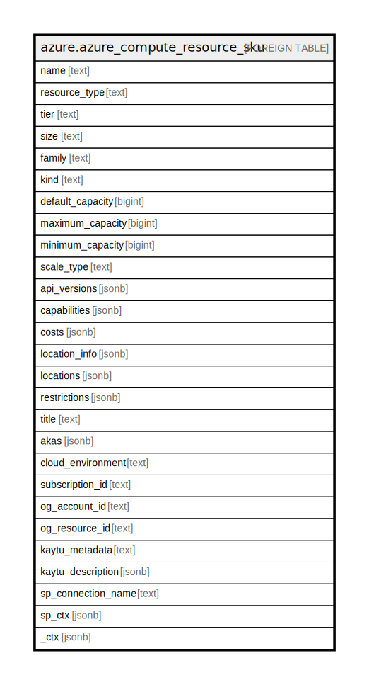

# azure.azure_compute_resource_sku

## Description

Azure Compute Resource SKU

## Columns

| Name | Type | Default | Nullable | Children | Parents | Comment |
| ---- | ---- | ------- | -------- | -------- | ------- | ------- |
| name | text |  | true |  |  | The name of SKU |
| resource_type | text |  | true |  |  | The type of resource the SKU applies to |
| tier | text |  | true |  |  | Specifies the tier of virtual machines in a scale set |
| size | text |  | true |  |  | The Size of the SKU |
| family | text |  | true |  |  | The Family of this particular SKU |
| kind | text |  | true |  |  | The Kind of resources that are supported in this SKU |
| default_capacity | bigint |  | true |  |  | Contains the default capacity |
| maximum_capacity | bigint |  | true |  |  | The maximum capacity that can be set |
| minimum_capacity | bigint |  | true |  |  | The minimum capacity that can be set |
| scale_type | text |  | true |  |  | The scale type applicable to the sku |
| api_versions | jsonb |  | true |  |  | The api versions that support this SKU |
| capabilities | jsonb |  | true |  |  | A name value pair to describe the capability |
| costs | jsonb |  | true |  |  | A list of metadata for retrieving price info |
| location_info | jsonb |  | true |  |  | A list of locations and availability zones in those locations where the SKU is available |
| locations | jsonb |  | true |  |  | The set of locations that the SKU is available |
| restrictions | jsonb |  | true |  |  | The restrictions because of which SKU cannot be used |
| title | text |  | true |  |  | Title of the resource. |
| akas | jsonb |  | true |  |  | Array of globally unique identifier strings (also known as) for the resource. |
| cloud_environment | text |  | true |  |  | The Azure Cloud Environment. |
| subscription_id | text |  | true |  |  | The Azure Subscription ID in which the resource is located. |
| og_account_id | text |  | true |  |  | The Platform Account ID in which the resource is located. |
| og_resource_id | text |  | true |  |  | The unique ID of the resource in opengovernance. |
| kaytu_metadata | text |  | true |  |  | Platform Metadata of the Azure resource. |
| kaytu_description | jsonb |  | true |  |  | The full model description of the resource |
| sp_connection_name | text |  | true |  |  | Steampipe connection name. |
| sp_ctx | jsonb |  | true |  |  | Steampipe context in JSON form. |
| _ctx | jsonb |  | true |  |  | Steampipe context in JSON form. |

## Relations

---

> Generated by [tbls](https://github.com/k1LoW/tbls)
