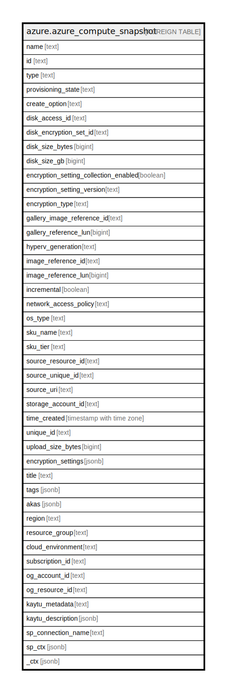

# azure.azure_compute_snapshot

## Description

Azure Compute Snapshot

## Columns

| Name | Type | Default | Nullable | Children | Parents | Comment |
| ---- | ---- | ------- | -------- | -------- | ------- | ------- |
| name | text |  | true |  |  | The friendly name that identifies the snapshot |
| id | text |  | true |  |  | The unique id identifying the resource in subscription |
| type | text |  | true |  |  | The type of the resource in Azure |
| provisioning_state | text |  | true |  |  | The disk provisioning state |
| create_option | text |  | true |  |  | Specifies the possible sources of a disk's creation |
| disk_access_id | text |  | true |  |  | ARM id of the DiskAccess resource for using private endpoints on disks |
| disk_encryption_set_id | text |  | true |  |  | ResourceId of the disk encryption set to use for enabling encryption at rest |
| disk_size_bytes | bigint |  | true |  |  | The size of the disk in bytes |
| disk_size_gb | bigint |  | true |  |  | The size of the disk to create |
| encryption_setting_collection_enabled | boolean |  | true |  |  | Specifies whether the encryption is enables, or not |
| encryption_setting_version | text |  | true |  |  | Describes what type of encryption is used for the disks |
| encryption_type | text |  | true |  |  | The type of the encryption |
| gallery_image_reference_id | text |  | true |  |  | A relative uri containing either a Platform Image Repository or user image reference |
| gallery_reference_lun | bigint |  | true |  |  | Specifies the index that indicates which of the data disks in the image to use |
| hyperv_generation | text |  | true |  |  | Specifies the hypervisor generation of the Virtual Machine |
| image_reference_id | text |  | true |  |  | A relative uri containing either a Platform Image Repository or user image reference |
| image_reference_lun | bigint |  | true |  |  | Specifies the index that indicates which of the data disks in the image to use |
| incremental | boolean |  | true |  |  | Specifies whether a snapshot is incremental, or not |
| network_access_policy | text |  | true |  |  | Contains the type of access |
| os_type | text |  | true |  |  | Contains the type of operating system |
| sku_name | text |  | true |  |  | The snapshot sku name |
| sku_tier | text |  | true |  |  | The sku tier |
| source_resource_id | text |  | true |  |  | ARM id of the source snapshot or disk |
| source_unique_id | text |  | true |  |  | An unique id identifying the source of this resource |
| source_uri | text |  | true |  |  | An URI of a blob to be imported into a managed disk |
| storage_account_id | text |  | true |  |  | The Azure Resource Manager identifier of the storage account containing the blob to import as a disk |
| time_created | timestamp with time zone |  | true |  |  | The time when the snapshot was created |
| unique_id | text |  | true |  |  | An unique Guid identifying the resource |
| upload_size_bytes | bigint |  | true |  |  | The size of the contents of the upload including the VHD footer |
| encryption_settings | jsonb |  | true |  |  | A list of encryption settings, one for each disk volume |
| title | text |  | true |  |  | Title of the resource. |
| tags | jsonb |  | true |  |  | A map of tags for the resource. |
| akas | jsonb |  | true |  |  | Array of globally unique identifier strings (also known as) for the resource. |
| region | text |  | true |  |  | The Azure region/location in which the resource is located. |
| resource_group | text |  | true |  |  | The resource group which holds this resource. |
| cloud_environment | text |  | true |  |  | The Azure Cloud Environment. |
| subscription_id | text |  | true |  |  | The Azure Subscription ID in which the resource is located. |
| og_account_id | text |  | true |  |  | The Platform Account ID in which the resource is located. |
| og_resource_id | text |  | true |  |  | The unique ID of the resource in opengovernance. |
| kaytu_metadata | text |  | true |  |  | Platform Metadata of the Azure resource. |
| kaytu_description | jsonb |  | true |  |  | The full model description of the resource |
| sp_connection_name | text |  | true |  |  | Steampipe connection name. |
| sp_ctx | jsonb |  | true |  |  | Steampipe context in JSON form. |
| _ctx | jsonb |  | true |  |  | Steampipe context in JSON form. |

## Relations

---

> Generated by [tbls](https://github.com/k1LoW/tbls)
