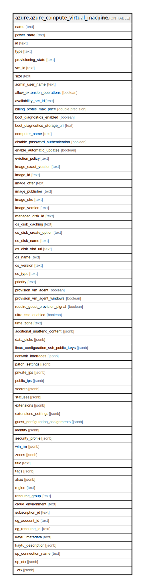

# azure.azure_compute_virtual_machine

## Description

Azure Compute Virtual Machine

## Columns

| Name | Type | Default | Nullable | Children | Parents | Comment |
| ---- | ---- | ------- | -------- | -------- | ------- | ------- |
| name | text |  | true |  |  | The friendly name that identifies the virtual machine. |
| power_state | text |  | true |  |  | Specifies the power state of the vm. |
| id | text |  | true |  |  | The unique id identifying the resource in subscription. |
| type | text |  | true |  |  | The type of the resource in Azure. |
| provisioning_state | text |  | true |  |  | The virtual machine provisioning state. |
| vm_id | text |  | true |  |  | Specifies an unique ID for VM, which is a 128-bits identifier that is encoded and stored in all Azure IaaS VMs SMBIOS and can be read using platform BIOS commands. |
| size | text |  | true |  |  | Specifies the size of the virtual machine. |
| admin_user_name | text |  | true |  |  | Specifies the name of the administrator account. |
| allow_extension_operations | boolean |  | true |  |  | Specifies whether extension operations should be allowed on the virtual machine. |
| availability_set_id | text |  | true |  |  | Specifies the ID of the availability set. |
| billing_profile_max_price | double precision |  | true |  |  | Specifies the maximum price you are willing to pay for a Azure Spot VM/VMSS. |
| boot_diagnostics_enabled | boolean |  | true |  |  | Specifies whether boot diagnostics should be enabled on the Virtual Machine, or not. |
| boot_diagnostics_storage_uri | text |  | true |  |  | Contains the Uri of the storage account to use for placing the console output and screenshot. |
| computer_name | text |  | true |  |  | Specifies the host OS name of the virtual machine. |
| disable_password_authentication | boolean |  | true |  |  | Specifies whether password authentication should be disabled. |
| enable_automatic_updates | boolean |  | true |  |  | Indicates whether automatic updates is enabled for the windows virtual machine. |
| eviction_policy | text |  | true |  |  | Specifies the eviction policy for the Azure Spot virtual machine and Azure Spot scale set. |
| image_exact_version | text |  | true |  |  | Specifies in decimal numbers, the version of platform image or marketplace image used to create the virtual machine. |
| image_id | text |  | true |  |  | Specifies the ID of the image to use. |
| image_offer | text |  | true |  |  | Specifies the offer of the platform image or marketplace image used to create the virtual machine. |
| image_publisher | text |  | true |  |  | Specifies the publisher of the image to use. |
| image_sku | text |  | true |  |  | Specifies the sku of the image to use. |
| image_version | text |  | true |  |  | Specifies the version of the platform image or marketplace image used to create the virtual machine. |
| managed_disk_id | text |  | true |  |  | Specifies the ID of the managed disk used by the virtual machine. |
| os_disk_caching | text |  | true |  |  | Specifies the caching requirements of the operating system disk used by the virtual machine. |
| os_disk_create_option | text |  | true |  |  | Specifies how the virtual machine should be created. |
| os_disk_name | text |  | true |  |  | Specifies the name of the operating system disk used by the virtual machine. |
| os_disk_vhd_uri | text |  | true |  |  | Specifies the virtual hard disk's uri. |
| os_name | text |  | true |  |  | The Operating System running on the virtual machine. |
| os_version | text |  | true |  |  | The version of Operating System running on the virtual machine. |
| os_type | text |  | true |  |  | Specifies the type of the OS that is included in the disk if creating a VM from user-image or a specialized VHD. |
| priority | text |  | true |  |  | Specifies the priority for the virtual machine. |
| provision_vm_agent | boolean |  | true |  |  | Specifies whether virtual machine agent should be provisioned on the virtual machine for linux configuration. |
| provision_vm_agent_windows | boolean |  | true |  |  | Specifies whether virtual machine agent should be provisioned on the virtual machine for windows configuration. |
| require_guest_provision_signal | boolean |  | true |  |  | Specifies whether the guest provision signal is required to infer provision success of the virtual machine. |
| ultra_ssd_enabled | boolean |  | true |  |  | Specifies whether managed disks with storage account type UltraSSD_LRS can be added to a virtual machine or virtual machine scale set, or not. |
| time_zone | text |  | true |  |  | Specifies the time zone of the virtual machine. |
| additional_unattend_content | jsonb |  | true |  |  | Specifies additional base-64 encoded XML formatted information that can be included in the Unattend.xml file, which is used by windows setup. |
| data_disks | jsonb |  | true |  |  | A list of parameters that are used to add a data disk to a virtual machine. |
| linux_configuration_ssh_public_keys | jsonb |  | true |  |  | A list of ssh key configuration for a Linux OS |
| network_interfaces | jsonb |  | true |  |  | A list of resource Ids for the network interfaces associated with the virtual machine. |
| patch_settings | jsonb |  | true |  |  | Specifies settings related to in-guest patching (KBs). |
| private_ips | jsonb |  | true |  |  | An array of private ip addesses associated with the vm. |
| public_ips | jsonb |  | true |  |  | An array of public ip addesses associated with the vm. |
| secrets | jsonb |  | true |  |  | A list of certificates that should be installed onto the virtual machine. |
| statuses | jsonb |  | true |  |  | Specifies the resource status information. |
| extensions | jsonb |  | true |  |  | Specifies the details of VM Extensions. |
| extensions_settings | jsonb |  | true |  |  | Specifies the details of VM Extensions settings map. |
| guest_configuration_assignments | jsonb |  | true |  |  | Guest configuration assignments for a virtual machine. |
| identity | jsonb |  | true |  |  | The identity of the virtual machine, if configured. |
| security_profile | jsonb |  | true |  |  | Specifies the security related profile settings for the virtual machine. |
| win_rm | jsonb |  | true |  |  | Specifies the windows remote management listeners. This enables remote windows powershell. |
| zones | jsonb |  | true |  |  | A list of virtual machine zones. |
| title | text |  | true |  |  | Title of the resource. |
| tags | jsonb |  | true |  |  | A map of tags for the resource. |
| akas | jsonb |  | true |  |  | Array of globally unique identifier strings (also known as) for the resource. |
| region | text |  | true |  |  | The Azure region/location in which the resource is located. |
| resource_group | text |  | true |  |  | The resource group which holds this resource. |
| cloud_environment | text |  | true |  |  | The Azure Cloud Environment. |
| subscription_id | text |  | true |  |  | The Azure Subscription ID in which the resource is located. |
| og_account_id | text |  | true |  |  | The Platform Account ID in which the resource is located. |
| og_resource_id | text |  | true |  |  | The unique ID of the resource in opengovernance. |
| kaytu_metadata | text |  | true |  |  | Platform Metadata of the Azure resource. |
| kaytu_description | jsonb |  | true |  |  | The full model description of the resource |
| sp_connection_name | text |  | true |  |  | Steampipe connection name. |
| sp_ctx | jsonb |  | true |  |  | Steampipe context in JSON form. |
| _ctx | jsonb |  | true |  |  | Steampipe context in JSON form. |

## Relations

---

> Generated by [tbls](https://github.com/k1LoW/tbls)
