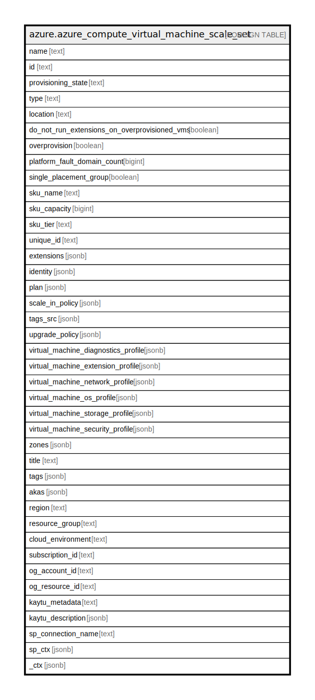

# azure.azure_compute_virtual_machine_scale_set

## Description

Azure Compute Virtual Machine Scale Set

## Columns

| Name | Type | Default | Nullable | Children | Parents | Comment |
| ---- | ---- | ------- | -------- | -------- | ------- | ------- |
| name | text |  | true |  |  | Name of the scale set. |
| id | text |  | true |  |  | The unique id identifying the resource in subscription. |
| provisioning_state | text |  | true |  |  | The provisioning state. |
| type | text |  | true |  |  | The type of the resource in Azure. |
| location | text |  | true |  |  | The location of the resource. |
| do_not_run_extensions_on_overprovisioned_vms | boolean |  | true |  |  | When Overprovision is enabled, extensions are launched only on the requested number of VMs which are finally kept. |
| overprovision | boolean |  | true |  |  | Specifies whether the Virtual Machine Scale Set should be overprovisioned. |
| platform_fault_domain_count | bigint |  | true |  |  | Fault Domain count for each placement group. |
| single_placement_group | boolean |  | true |  |  | When true this limits the scale set to a single placement group, of max size 100 virtual machines. |
| sku_name | text |  | true |  |  | The sku name. |
| sku_capacity | bigint |  | true |  |  | Specifies the tier of virtual machines in a scale set. |
| sku_tier | text |  | true |  |  | Specifies the tier of virtual machines in a scale set. |
| unique_id | text |  | true |  |  | Specifies the ID which uniquely identifies a Virtual Machine Scale Set. |
| extensions | jsonb |  | true |  |  | Specifies the details of VM Scale Set Extensions. |
| identity | jsonb |  | true |  |  | The identity of the virtual machine scale set, if configured. |
| plan | jsonb |  | true |  |  | Specifies information about the marketplace image used to create the virtual machine. |
| scale_in_policy | jsonb |  | true |  |  | Specifies the scale-in policy that decides which virtual machines are chosen for removal when a Virtual Machine Scale Set is scaled-in. |
| tags_src | jsonb |  | true |  |  | Resource tags. |
| upgrade_policy | jsonb |  | true |  |  | The upgrade policy for the scale set. |
| virtual_machine_diagnostics_profile | jsonb |  | true |  |  | Specifies the boot diagnostic settings state. |
| virtual_machine_extension_profile | jsonb |  | true |  |  | Specifies a collection of settings for extensions installed on virtual machines in the scale set. |
| virtual_machine_network_profile | jsonb |  | true |  |  | Specifies properties of the network interfaces of the virtual machines in the scale set. |
| virtual_machine_os_profile | jsonb |  | true |  |  | Specifies the operating system settings for the virtual machines in the scale set. |
| virtual_machine_storage_profile | jsonb |  | true |  |  | Specifies the storage settings for the virtual machine disks. |
| virtual_machine_security_profile | jsonb |  | true |  |  | Specifies the Security related profile settings for the virtual machines in the scale set. |
| zones | jsonb |  | true |  |  | The Logical zone list for scale set. |
| title | text |  | true |  |  | Title of the resource. |
| tags | jsonb |  | true |  |  | A map of tags for the resource. |
| akas | jsonb |  | true |  |  | Array of globally unique identifier strings (also known as) for the resource. |
| region | text |  | true |  |  | The Azure region/location in which the resource is located. |
| resource_group | text |  | true |  |  | The resource group which holds this resource. |
| cloud_environment | text |  | true |  |  | The Azure Cloud Environment. |
| subscription_id | text |  | true |  |  | The Azure Subscription ID in which the resource is located. |
| og_account_id | text |  | true |  |  | The Platform Account ID in which the resource is located. |
| og_resource_id | text |  | true |  |  | The unique ID of the resource in opengovernance. |
| kaytu_metadata | text |  | true |  |  | Platform Metadata of the Azure resource. |
| kaytu_description | jsonb |  | true |  |  | The full model description of the resource |
| sp_connection_name | text |  | true |  |  | Steampipe connection name. |
| sp_ctx | jsonb |  | true |  |  | Steampipe context in JSON form. |
| _ctx | jsonb |  | true |  |  | Steampipe context in JSON form. |

## Relations

---

> Generated by [tbls](https://github.com/k1LoW/tbls)
