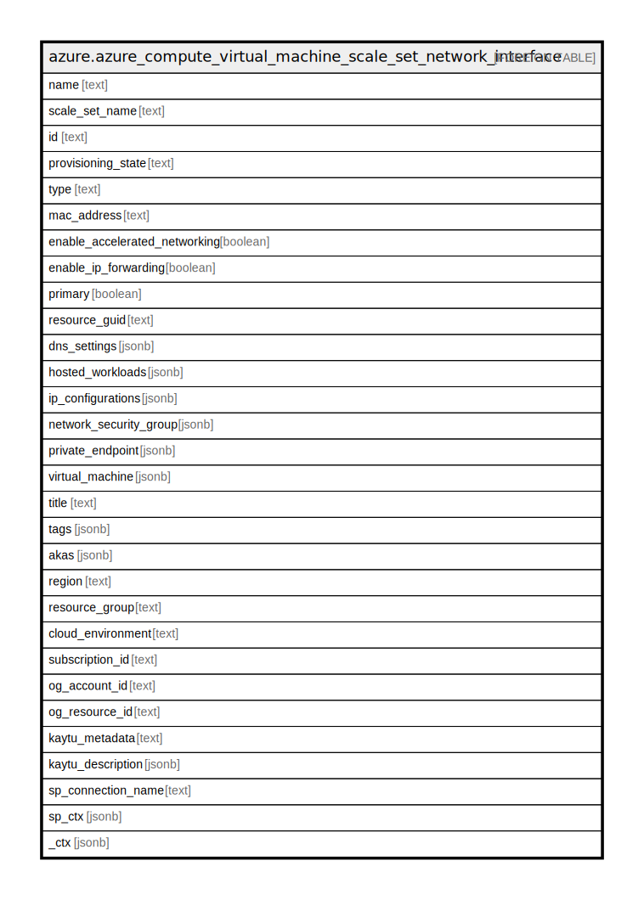

# azure.azure_compute_virtual_machine_scale_set_network_interface

## Description

Azure Compute Virtual Machine Scale Set Network Interface

## Columns

| Name | Type | Default | Nullable | Children | Parents | Comment |
| ---- | ---- | ------- | -------- | -------- | ------- | ------- |
| name | text |  | true |  |  | Name of the scale set network interface. |
| scale_set_name | text |  | true |  |  | Name of the scale set. |
| id | text |  | true |  |  | The unique ID identifying the resource in a subscription. |
| provisioning_state | text |  | true |  |  | The provisioning state of the network interface resource. Possible values include: 'Succeeded', 'Updating', 'Deleting', 'Failed'. |
| type | text |  | true |  |  | The type of the resource in Azure. |
| mac_address | text |  | true |  |  | The MAC address of the network interface. |
| enable_accelerated_networking | boolean |  | true |  |  | If the network interface has accelerated networking enabled. |
| enable_ip_forwarding | boolean |  | true |  |  | Indicates whether IP forwarding is enabled on this network interface. |
| primary | boolean |  | true |  |  | Whether this is a primary network interface on a virtual machine. |
| resource_guid | text |  | true |  |  | The resource GUID property of the network interface resource. |
| dns_settings | jsonb |  | true |  |  | The DNS settings in network interface. |
| hosted_workloads | jsonb |  | true |  |  | A list of references to linked BareMetal resources. |
| ip_configurations | jsonb |  | true |  |  | A list of IP configurations of the network interface. |
| network_security_group | jsonb |  | true |  |  | The reference to the NetworkSecurityGroup resource. |
| private_endpoint | jsonb |  | true |  |  | A reference to the private endpoint to which the network interface is linked. |
| virtual_machine | jsonb |  | true |  |  | The reference to a virtual machine. |
| title | text |  | true |  |  | Title of the resource. |
| tags | jsonb |  | true |  |  | A map of tags for the resource. |
| akas | jsonb |  | true |  |  | Array of globally unique identifier strings (also known as) for the resource. |
| region | text |  | true |  |  | The Azure region/location in which the resource is located. |
| resource_group | text |  | true |  |  | The resource group which holds this resource. |
| cloud_environment | text |  | true |  |  | The Azure Cloud Environment. |
| subscription_id | text |  | true |  |  | The Azure Subscription ID in which the resource is located. |
| og_account_id | text |  | true |  |  | The Platform Account ID in which the resource is located. |
| og_resource_id | text |  | true |  |  | The unique ID of the resource in opengovernance. |
| kaytu_metadata | text |  | true |  |  | Platform Metadata of the Azure resource. |
| kaytu_description | jsonb |  | true |  |  | The full model description of the resource |
| sp_connection_name | text |  | true |  |  | Steampipe connection name. |
| sp_ctx | jsonb |  | true |  |  | Steampipe context in JSON form. |
| _ctx | jsonb |  | true |  |  | Steampipe context in JSON form. |

## Relations

---

> Generated by [tbls](https://github.com/k1LoW/tbls)
