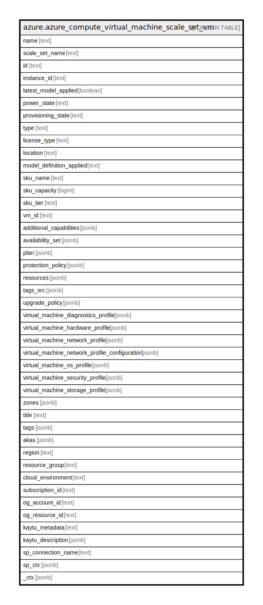

# azure.azure_compute_virtual_machine_scale_set_vm

## Description

Azure Compute Virtual Machine Scale Set VM

## Columns

| Name | Type | Default | Nullable | Children | Parents | Comment |
| ---- | ---- | ------- | -------- | -------- | ------- | ------- |
| name | text |  | true |  |  | Name of the scale set VM. |
| scale_set_name | text |  | true |  |  | Name of the scale set. |
| id | text |  | true |  |  | The unique id identifying the resource in subscription. |
| instance_id | text |  | true |  |  | The virtual machine instance ID. |
| latest_model_applied | boolean |  | true |  |  | Specifies whether the latest model has been applied to the virtual machine. |
| power_state | text |  | true |  |  | Specifies the power state of the VM. |
| provisioning_state | text |  | true |  |  | The provisioning state. |
| type | text |  | true |  |  | The type of the resource in Azure. |
| license_type | text |  | true |  |  | Specifies that the image or disk that is being used was licensed on-premises. |
| location | text |  | true |  |  | The location of the resource. |
| model_definition_applied | text |  | true |  |  | Specifies whether the model applied to the virtual machine is the model of the virtual machine scale set or the customized model for the virtual machine. |
| sku_name | text |  | true |  |  | The sku name. |
| sku_capacity | bigint |  | true |  |  | Specifies the capacity of virtual machines in a scale set virtual machine. |
| sku_tier | text |  | true |  |  | Specifies the tier of virtual machines in a scale set virtual machine. |
| vm_id | text |  | true |  |  | Azure virtual machine unique ID. |
| additional_capabilities | jsonb |  | true |  |  | Specifies additional capabilities enabled or disabled on the virtual machine in the scale set. For instance: whether the virtual machine has the capability to support attaching managed data disks with UltraSSD_LRS storage account type. |
| availability_set | jsonb |  | true |  |  | Specifies information about the availability set that the virtual machine should be assigned to. Virtual machines specified in the same availability set are allocated to different nodes to maximize availability. |
| plan | jsonb |  | true |  |  | Specifies information about the marketplace image used to create the virtual machine. |
| protection_policy | jsonb |  | true |  |  | Specifies the protection policy of the virtual machine. |
| resources | jsonb |  | true |  |  | The virtual machine child extension resources. |
| tags_src | jsonb |  | true |  |  | Resource tags. |
| upgrade_policy | jsonb |  | true |  |  | The upgrade policy for the scale set. |
| virtual_machine_diagnostics_profile | jsonb |  | true |  |  | Specifies the boot diagnostic settings state. |
| virtual_machine_hardware_profile | jsonb |  | true |  |  | Specifies the hardware settings for the virtual machine. |
| virtual_machine_network_profile | jsonb |  | true |  |  | Specifies properties of the network interfaces of the virtual machines. |
| virtual_machine_network_profile_configuration | jsonb |  | true |  |  | Specifies the network profile configuration of the virtual machine. |
| virtual_machine_os_profile | jsonb |  | true |  |  | Specifies the operating system settings for the virtual machines. |
| virtual_machine_security_profile | jsonb |  | true |  |  | Specifies the Security related profile settings for the virtual machine. |
| virtual_machine_storage_profile | jsonb |  | true |  |  | SSpecifies the storage settings for the virtual machine disks. |
| zones | jsonb |  | true |  |  | The Logical zone list for scale set. |
| title | text |  | true |  |  | Title of the resource. |
| tags | jsonb |  | true |  |  | A map of tags for the resource. |
| akas | jsonb |  | true |  |  | Array of globally unique identifier strings (also known as) for the resource. |
| region | text |  | true |  |  | The Azure region/location in which the resource is located. |
| resource_group | text |  | true |  |  | The resource group which holds this resource. |
| cloud_environment | text |  | true |  |  | The Azure Cloud Environment. |
| subscription_id | text |  | true |  |  | The Azure Subscription ID in which the resource is located. |
| og_account_id | text |  | true |  |  | The Platform Account ID in which the resource is located. |
| og_resource_id | text |  | true |  |  | The unique ID of the resource in opengovernance. |
| kaytu_metadata | text |  | true |  |  | Platform Metadata of the Azure resource. |
| kaytu_description | jsonb |  | true |  |  | The full model description of the resource |
| sp_connection_name | text |  | true |  |  | Steampipe connection name. |
| sp_ctx | jsonb |  | true |  |  | Steampipe context in JSON form. |
| _ctx | jsonb |  | true |  |  | Steampipe context in JSON form. |

## Relations

---

> Generated by [tbls](https://github.com/k1LoW/tbls)
