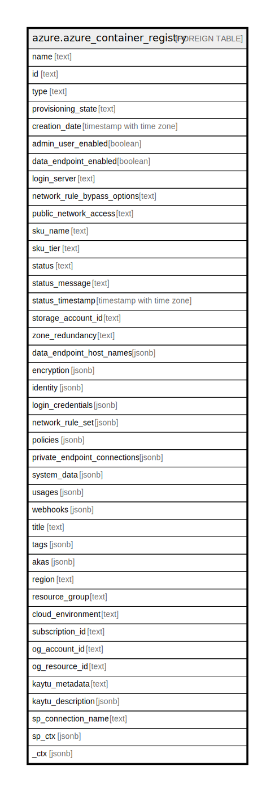

# azure.azure_container_registry

## Description

Azure Container Registry

## Columns

| Name | Type | Default | Nullable | Children | Parents | Comment |
| ---- | ---- | ------- | -------- | -------- | ------- | ------- |
| name | text |  | true |  |  | The name of the resource. |
| id | text |  | true |  |  | The unique id identifying the resource in subscription. |
| type | text |  | true |  |  | The type of the resource. |
| provisioning_state | text |  | true |  |  | The provisioning state of the container registry at the time the operation was called. Valid values are: 'Creating', 'Updating', 'Deleting', 'Succeeded', 'Failed', 'Canceled'. |
| creation_date | timestamp with time zone |  | true |  |  | The creation date of the container registry. |
| admin_user_enabled | boolean |  | true |  |  | Indicates whether the admin user is enabled, or not. |
| data_endpoint_enabled | boolean |  | true |  |  | Enable a single data endpoint per region for serving data. |
| login_server | text |  | true |  |  | The URL that can be used to log into the container registry. |
| network_rule_bypass_options | text |  | true |  |  | Indicates whether to allow trusted Azure services to access a network restricted registry. Valid values are: 'AzureServices', 'None'. |
| public_network_access | text |  | true |  |  | Indicates whether or not public network access is allowed for the container registry. Valid values are: 'Enabled', 'Disabled'. |
| sku_name | text |  | true |  |  | The SKU name of the container registry. Required for registry creation. Valid values are: 'Classic', 'Basic', 'Standard', 'Premium'. |
| sku_tier | text |  | true |  |  | The SKU tier based on the SKU name. Valid values are: 'Classic', 'Basic', 'Standard', 'Premium'. |
| status | text |  | true |  |  | The current status of the resource. |
| status_message | text |  | true |  |  | The detailed message for the status, including alerts and error messages. |
| status_timestamp | timestamp with time zone |  | true |  |  | The timestamp when the status was changed to the current value. |
| storage_account_id | text |  | true |  |  | The resource ID of the storage account. Only applicable to Classic SKU. |
| zone_redundancy | text |  | true |  |  | Indicates whether or not zone redundancy is enabled for this container registry. Valid values are: 'Enabled', 'Disabled'. |
| data_endpoint_host_names | jsonb |  | true |  |  | A list of host names that will serve data when dataEndpointEnabled is true. |
| encryption | jsonb |  | true |  |  | The encryption settings of container registry. |
| identity | jsonb |  | true |  |  | The identity of the container registry. |
| login_credentials | jsonb |  | true |  |  | The login credentials for the specified container registry. |
| network_rule_set | jsonb |  | true |  |  | The network rule set for a container registry. |
| policies | jsonb |  | true |  |  | The policies for a container registry. |
| private_endpoint_connections | jsonb |  | true |  |  | A list of private endpoint connections for a container registry. |
| system_data | jsonb |  | true |  |  | Metadata pertaining to creation and last modification of the resource. |
| usages | jsonb |  | true |  |  | Specifies the quota usages for the specified container registry. |
| webhooks | jsonb |  | true |  |  | Webhooks in Azure Container Registry provide a way to trigger custom actions in response to events happening within the registry. |
| title | text |  | true |  |  | Title of the resource. |
| tags | jsonb |  | true |  |  | A map of tags for the resource. |
| akas | jsonb |  | true |  |  | Array of globally unique identifier strings (also known as) for the resource. |
| region | text |  | true |  |  | The Azure region/location in which the resource is located. |
| resource_group | text |  | true |  |  | The resource group which holds this resource. |
| cloud_environment | text |  | true |  |  | The Azure Cloud Environment. |
| subscription_id | text |  | true |  |  | The Azure Subscription ID in which the resource is located. |
| og_account_id | text |  | true |  |  | The Platform Account ID in which the resource is located. |
| og_resource_id | text |  | true |  |  | The unique ID of the resource in opengovernance. |
| kaytu_metadata | text |  | true |  |  | Platform Metadata of the Azure resource. |
| kaytu_description | jsonb |  | true |  |  | The full model description of the resource |
| sp_connection_name | text |  | true |  |  | Steampipe connection name. |
| sp_ctx | jsonb |  | true |  |  | Steampipe context in JSON form. |
| _ctx | jsonb |  | true |  |  | Steampipe context in JSON form. |

## Relations

---

> Generated by [tbls](https://github.com/k1LoW/tbls)
