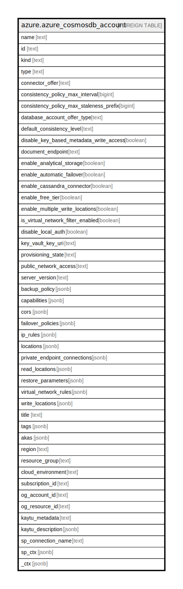

# azure.azure_cosmosdb_account

## Description

Azure Cosmos DB Account

## Columns

| Name | Type | Default | Nullable | Children | Parents | Comment |
| ---- | ---- | ------- | -------- | -------- | ------- | ------- |
| name | text |  | true |  |  | The friendly name that identifies the database account. |
| id | text |  | true |  |  | Contains ID to identify a database account uniquely. |
| kind | text |  | true |  |  | Indicates the type of database account. |
| type | text |  | true |  |  | Type of the resource. |
| connector_offer | text |  | true |  |  | The cassandra connector offer type for the Cosmos DB database C* account. |
| consistency_policy_max_interval | bigint |  | true |  |  | The time amount of staleness (in seconds) tolerated, when used with the Bounded Staleness consistency level. |
| consistency_policy_max_staleness_prefix | bigint |  | true |  |  | The number of stale requests tolerated, when used with the Bounded Staleness consistency level. |
| database_account_offer_type | text |  | true |  |  | The offer type for the Cosmos DB database account. |
| default_consistency_level | text |  | true |  |  | The default consistency level and configuration settings of the Cosmos DB account. |
| disable_key_based_metadata_write_access | boolean |  | true |  |  | Disable write operations on metadata resources (databases, containers, throughput) via account keys. |
| document_endpoint | text |  | true |  |  | The connection endpoint for the Cosmos DB database account. |
| enable_analytical_storage | boolean |  | true |  |  | Specifies whether to enable storage analytics, or not. |
| enable_automatic_failover | boolean |  | true |  |  | Enables automatic failover of the write region in the rare event that the region is unavailable due to an outage. |
| enable_cassandra_connector | boolean |  | true |  |  | Enables the cassandra connector on the Cosmos DB C* account. |
| enable_free_tier | boolean |  | true |  |  | Specifies whether free Tier is enabled for Cosmos DB database account, or not. |
| enable_multiple_write_locations | boolean |  | true |  |  | Enables the account to write in multiple locations. |
| is_virtual_network_filter_enabled | boolean |  | true |  |  | Specifies whether to enable/disable Virtual Network ACL rules. |
| disable_local_auth | boolean |  | true |  |  | Disable local authentication and ensure only MSI and AAD can be used exclusively for authentication. Defaults to false. |
| key_vault_key_uri | text |  | true |  |  | The URI of the key vault, used to encrypt the Cosmos DB database account. |
| provisioning_state | text |  | true |  |  | The provisioning state of the database account resource. |
| public_network_access | text |  | true |  |  | Indicates whether requests from Public Network are allowed. |
| server_version | text |  | true |  |  | Describes the ServerVersion of an a MongoDB account. |
| backup_policy | jsonb |  | true |  |  | The object representing the policy for taking backups on an account. |
| capabilities | jsonb |  | true |  |  | A list of Cosmos DB capabilities for the account. |
| cors | jsonb |  | true |  |  | A list of CORS policy for the Cosmos DB database account. |
| failover_policies | jsonb |  | true |  |  | A list of regions ordered by their failover priorities. |
| ip_rules | jsonb |  | true |  |  | A list of IP rules. |
| locations | jsonb |  | true |  |  | A list of all locations that are enabled for the Cosmos DB account. |
| private_endpoint_connections | jsonb |  | true |  |  | A list of Private Endpoint Connections configured for the Cosmos DB account. |
| read_locations | jsonb |  | true |  |  | A list of read locations enabled for the Cosmos DB account. |
| restore_parameters | jsonb |  | true |  |  | Parameters to indicate the information about the restore. |
| virtual_network_rules | jsonb |  | true |  |  | A list of Virtual Network ACL rules configured for the Cosmos DB account. |
| write_locations | jsonb |  | true |  |  | A list of write locations enabled for the Cosmos DB account. |
| title | text |  | true |  |  | Title of the resource. |
| tags | jsonb |  | true |  |  | A map of tags for the resource. |
| akas | jsonb |  | true |  |  | Array of globally unique identifier strings (also known as) for the resource. |
| region | text |  | true |  |  | The Azure region/location in which the resource is located. |
| resource_group | text |  | true |  |  | The resource group which holds this resource. |
| cloud_environment | text |  | true |  |  | The Azure Cloud Environment. |
| subscription_id | text |  | true |  |  | The Azure Subscription ID in which the resource is located. |
| og_account_id | text |  | true |  |  | The Platform Account ID in which the resource is located. |
| og_resource_id | text |  | true |  |  | The unique ID of the resource in opengovernance. |
| kaytu_metadata | text |  | true |  |  | Platform Metadata of the Azure resource. |
| kaytu_description | jsonb |  | true |  |  | The full model description of the resource |
| sp_connection_name | text |  | true |  |  | Steampipe connection name. |
| sp_ctx | jsonb |  | true |  |  | Steampipe context in JSON form. |
| _ctx | jsonb |  | true |  |  | Steampipe context in JSON form. |

## Relations

---

> Generated by [tbls](https://github.com/k1LoW/tbls)
