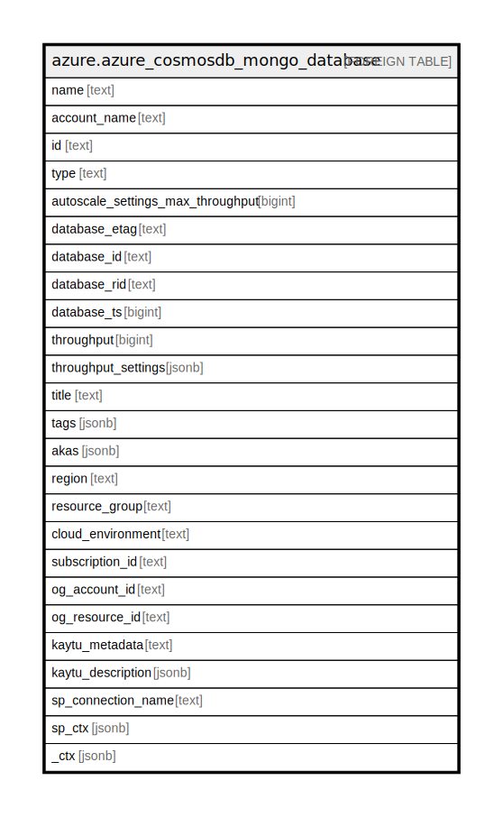

# azure.azure_cosmosdb_mongo_database

## Description

Azure Cosmos DB Mongo Database

## Columns

| Name | Type | Default | Nullable | Children | Parents | Comment |
| ---- | ---- | ------- | -------- | -------- | ------- | ------- |
| name | text |  | true |  |  | The friendly name that identifies the Mongo DB database. |
| account_name | text |  | true |  |  | The friendly name that identifies the database account in which the database is created. |
| id | text |  | true |  |  | Contains ID to identify a Mongo DB database uniquely. |
| type | text |  | true |  |  | Type of the resource. |
| autoscale_settings_max_throughput | bigint |  | true |  |  | Contains maximum throughput, the resource can scale up to. |
| database_etag | text |  | true |  |  | A system generated property representing the resource etag required for optimistic concurrency control. |
| database_id | text |  | true |  |  | Name of the Cosmos DB MongoDB database. |
| database_rid | text |  | true |  |  | A system generated unique identifier for database. |
| database_ts | bigint |  | true |  |  | A system generated property that denotes the last updated timestamp of the resource. |
| throughput | bigint |  | true |  |  | Contains the value of the Cosmos DB resource throughput or autoscaleSettings. |
| throughput_settings | jsonb |  | true |  |  | Contains the value of the Cosmos DB resource throughput or autoscaleSettings. |
| title | text |  | true |  |  | Title of the resource. |
| tags | jsonb |  | true |  |  | A map of tags for the resource. |
| akas | jsonb |  | true |  |  | Array of globally unique identifier strings (also known as) for the resource. |
| region | text |  | true |  |  | The Azure region/location in which the resource is located. |
| resource_group | text |  | true |  |  | The resource group which holds this resource. |
| cloud_environment | text |  | true |  |  | The Azure Cloud Environment. |
| subscription_id | text |  | true |  |  | The Azure Subscription ID in which the resource is located. |
| og_account_id | text |  | true |  |  | The Platform Account ID in which the resource is located. |
| og_resource_id | text |  | true |  |  | The unique ID of the resource in opengovernance. |
| kaytu_metadata | text |  | true |  |  | Platform Metadata of the Azure resource. |
| kaytu_description | jsonb |  | true |  |  | The full model description of the resource |
| sp_connection_name | text |  | true |  |  | Steampipe connection name. |
| sp_ctx | jsonb |  | true |  |  | Steampipe context in JSON form. |
| _ctx | jsonb |  | true |  |  | Steampipe context in JSON form. |

## Relations

---

> Generated by [tbls](https://github.com/k1LoW/tbls)
