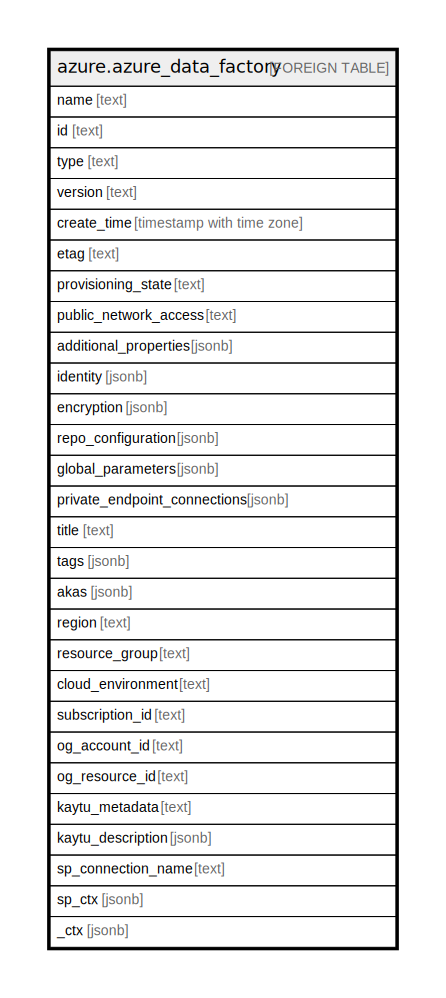

# azure.azure_data_factory

## Description

Azure Data Factory

## Columns

| Name | Type | Default | Nullable | Children | Parents | Comment |
| ---- | ---- | ------- | -------- | -------- | ------- | ------- |
| name | text |  | true |  |  | The resource name. |
| id | text |  | true |  |  | The resource identifier. |
| type | text |  | true |  |  | The resource type. |
| version | text |  | true |  |  | Version of the factory. |
| create_time | timestamp with time zone |  | true |  |  | Specifies the time, the factory was created. |
| etag | text |  | true |  |  | An unique read-only string that changes whenever the resource is updated. |
| provisioning_state | text |  | true |  |  | Factory provisioning state, example Succeeded. |
| public_network_access | text |  | true |  |  | Whether or not public network access is allowed for the data factory. |
| additional_properties | jsonb |  | true |  |  | Unmatched properties from the message are deserialized this collection. |
| identity | jsonb |  | true |  |  | Managed service identity of the factory. |
| encryption | jsonb |  | true |  |  | Properties to enable Customer Managed Key for the factory. |
| repo_configuration | jsonb |  | true |  |  | Git repo information of the factory. |
| global_parameters | jsonb |  | true |  |  | List of parameters for factory. |
| private_endpoint_connections | jsonb |  | true |  |  | List of private endpoint connections for data factory. |
| title | text |  | true |  |  | Title of the resource. |
| tags | jsonb |  | true |  |  | A map of tags for the resource. |
| akas | jsonb |  | true |  |  | Array of globally unique identifier strings (also known as) for the resource. |
| region | text |  | true |  |  | The Azure region/location in which the resource is located. |
| resource_group | text |  | true |  |  | The resource group which holds this resource. |
| cloud_environment | text |  | true |  |  | The Azure Cloud Environment. |
| subscription_id | text |  | true |  |  | The Azure Subscription ID in which the resource is located. |
| og_account_id | text |  | true |  |  | The Platform Account ID in which the resource is located. |
| og_resource_id | text |  | true |  |  | The unique ID of the resource in opengovernance. |
| kaytu_metadata | text |  | true |  |  | Platform Metadata of the Azure resource. |
| kaytu_description | jsonb |  | true |  |  | The full model description of the resource |
| sp_connection_name | text |  | true |  |  | Steampipe connection name. |
| sp_ctx | jsonb |  | true |  |  | Steampipe context in JSON form. |
| _ctx | jsonb |  | true |  |  | Steampipe context in JSON form. |

## Relations

---

> Generated by [tbls](https://github.com/k1LoW/tbls)
