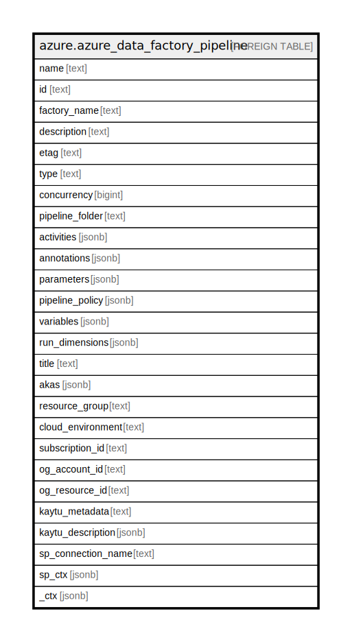

# azure.azure_data_factory_pipeline

## Description

Azure Data Factory Pipeline

## Columns

| Name | Type | Default | Nullable | Children | Parents | Comment |
| ---- | ---- | ------- | -------- | -------- | ------- | ------- |
| name | text |  | true |  |  | The resource name. |
| id | text |  | true |  |  | The resource identifier. |
| factory_name | text |  | true |  |  | Name of the factory the pipeline belongs. |
| description | text |  | true |  |  | The description of the pipeline. |
| etag | text |  | true |  |  | An unique read-only string that changes whenever the resource is updated. |
| type | text |  | true |  |  | The resource type. |
| concurrency | bigint |  | true |  |  | The max number of concurrent runs for the pipeline. |
| pipeline_folder | text |  | true |  |  | The folder that this Pipeline is in. If not specified, Pipeline will appear at the root level. |
| activities | jsonb |  | true |  |  | A list of activities in pipeline. |
| annotations | jsonb |  | true |  |  | A list of tags that can be used for describing the Pipeline. |
| parameters | jsonb |  | true |  |  | A list of parameters for pipeline. |
| pipeline_policy | jsonb |  | true |  |  | Pipeline ElapsedTime Metric Policy. |
| variables | jsonb |  | true |  |  | A list of variables for pipeline. |
| run_dimensions | jsonb |  | true |  |  | Dimensions emitted by Pipeline. |
| title | text |  | true |  |  | Title of the resource. |
| akas | jsonb |  | true |  |  | Array of globally unique identifier strings (also known as) for the resource. |
| resource_group | text |  | true |  |  | The resource group which holds this resource. |
| cloud_environment | text |  | true |  |  | The Azure Cloud Environment. |
| subscription_id | text |  | true |  |  | The Azure Subscription ID in which the resource is located. |
| og_account_id | text |  | true |  |  | The Platform Account ID in which the resource is located. |
| og_resource_id | text |  | true |  |  | The unique ID of the resource in opengovernance. |
| kaytu_metadata | text |  | true |  |  | Platform Metadata of the Azure resource. |
| kaytu_description | jsonb |  | true |  |  | The full model description of the resource |
| sp_connection_name | text |  | true |  |  | Steampipe connection name. |
| sp_ctx | jsonb |  | true |  |  | Steampipe context in JSON form. |
| _ctx | jsonb |  | true |  |  | Steampipe context in JSON form. |

## Relations

---

> Generated by [tbls](https://github.com/k1LoW/tbls)
