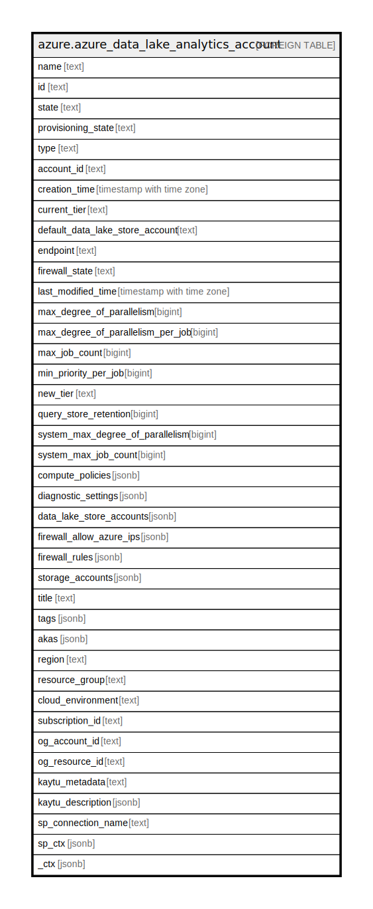

# azure.azure_data_lake_analytics_account

## Description

Azure Data Lake Analytics account

## Columns

| Name | Type | Default | Nullable | Children | Parents | Comment |
| ---- | ---- | ------- | -------- | -------- | ------- | ------- |
| name | text |  | true |  |  | The resource name. |
| id | text |  | true |  |  | The resource identifier. |
| state | text |  | true |  |  | The state of the data lake analytics account. |
| provisioning_state | text |  | true |  |  | The provisioning status of the data lake analytics account. |
| type | text |  | true |  |  | The resource type. |
| account_id | text |  | true |  |  | The unique identifier associated with this data lake analytics account. |
| creation_time | timestamp with time zone |  | true |  |  | The data lake analytics account creation time. |
| current_tier | text |  | true |  |  | The commitment tier in use for current month. |
| default_data_lake_store_account | text |  | true |  |  | The default data lake store account associated with this data lake analytics account. |
| endpoint | text |  | true |  |  | The full cname endpoint for this data lake analytics account. |
| firewall_state | text |  | true |  |  | The current state of the IP address firewall for this data lake analytics account. |
| last_modified_time | timestamp with time zone |  | true |  |  | The data lake analytics account last modified time. |
| max_degree_of_parallelism | bigint |  | true |  |  | The maximum supported degree of parallelism for this data lake analytics account. |
| max_degree_of_parallelism_per_job | bigint |  | true |  |  | The maximum supported degree of parallelism per job for this data lake analytics account. |
| max_job_count | bigint |  | true |  |  | The maximum supported jobs running under the data lake analytics account at the same time. |
| min_priority_per_job | bigint |  | true |  |  | The minimum supported priority per job for this data lake analytics account. |
| new_tier | text |  | true |  |  | The commitment tier to use for next month. |
| query_store_retention | bigint |  | true |  |  | The number of days that job metadata is retained. |
| system_max_degree_of_parallelism | bigint |  | true |  |  | The system defined maximum supported degree of parallelism for this account, which restricts the maximum value of parallelism the user can set for the data lake analytics account. |
| system_max_job_count | bigint |  | true |  |  | The system defined maximum supported jobs running under the account at the same time, which restricts the maximum number of running jobs the user can set for the data lake analytics account. |
| compute_policies | jsonb |  | true |  |  | The list of compute policies associated with this data lake analytics account. |
| diagnostic_settings | jsonb |  | true |  |  | A list of active diagnostic settings for the data lake analytics account. |
| data_lake_store_accounts | jsonb |  | true |  |  | The list of data lake store accounts associated with this data lake analytics account. |
| firewall_allow_azure_ips | jsonb |  | true |  |  | The current state of allowing or disallowing IPs originating within azure through the firewall. If the firewall is disabled, this is not enforced. |
| firewall_rules | jsonb |  | true |  |  | The list of firewall rules associated with this data lake analytics account. |
| storage_accounts | jsonb |  | true |  |  | The list of azure blob storage accounts associated with this data lake analytics account. |
| title | text |  | true |  |  | Title of the resource. |
| tags | jsonb |  | true |  |  | A map of tags for the resource. |
| akas | jsonb |  | true |  |  | Array of globally unique identifier strings (also known as) for the resource. |
| region | text |  | true |  |  | The Azure region/location in which the resource is located. |
| resource_group | text |  | true |  |  | The resource group which holds this resource. |
| cloud_environment | text |  | true |  |  | The Azure Cloud Environment. |
| subscription_id | text |  | true |  |  | The Azure Subscription ID in which the resource is located. |
| og_account_id | text |  | true |  |  | The Platform Account ID in which the resource is located. |
| og_resource_id | text |  | true |  |  | The unique ID of the resource in opengovernance. |
| kaytu_metadata | text |  | true |  |  | Platform Metadata of the Azure resource. |
| kaytu_description | jsonb |  | true |  |  | The full model description of the resource |
| sp_connection_name | text |  | true |  |  | Steampipe connection name. |
| sp_ctx | jsonb |  | true |  |  | Steampipe context in JSON form. |
| _ctx | jsonb |  | true |  |  | Steampipe context in JSON form. |

## Relations

---

> Generated by [tbls](https://github.com/k1LoW/tbls)
