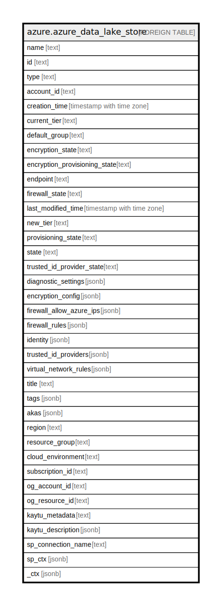

# azure.azure_data_lake_store

## Description

Azure Data Lake Store

## Columns

| Name | Type | Default | Nullable | Children | Parents | Comment |
| ---- | ---- | ------- | -------- | -------- | ------- | ------- |
| name | text |  | true |  |  | The resource name. |
| id | text |  | true |  |  | The resource identifier. |
| type | text |  | true |  |  | The resource type. |
| account_id | text |  | true |  |  | The unique identifier associated with this data lake store account. |
| creation_time | timestamp with time zone |  | true |  |  | The account creation time. |
| current_tier | text |  | true |  |  | The commitment tier in use for current month. |
| default_group | text |  | true |  |  | The default owner group for all new folders and files created in the data lake store account. |
| encryption_state | text |  | true |  |  | The current state of encryption for this data lake store account. |
| encryption_provisioning_state | text |  | true |  |  | The current state of encryption provisioning for this data lake store account. |
| endpoint | text |  | true |  |  | The full cname endpoint for this account. |
| firewall_state | text |  | true |  |  | The current state of the IP address firewall for this data lake store account. |
| last_modified_time | timestamp with time zone |  | true |  |  | The account last modified time. |
| new_tier | text |  | true |  |  | The commitment tier to use for next month. |
| provisioning_state | text |  | true |  |  | The provisioning status of the data lake store account. |
| state | text |  | true |  |  | The state of the data lake store account. |
| trusted_id_provider_state | text |  | true |  |  | The current state of the trusted identity provider feature for this data lake store account. |
| diagnostic_settings | jsonb |  | true |  |  | A list of active diagnostic settings for the data lake store. |
| encryption_config | jsonb |  | true |  |  | The key vault encryption configuration. |
| firewall_allow_azure_ips | jsonb |  | true |  |  | The current state of allowing or disallowing IPs originating within azure through the firewall. If the firewall is disabled, this is not enforced. |
| firewall_rules | jsonb |  | true |  |  | The list of firewall rules associated with this data lake store account. |
| identity | jsonb |  | true |  |  | The key vault encryption identity, if any. |
| trusted_id_providers | jsonb |  | true |  |  | The list of trusted identity providers associated with this data lake store account. |
| virtual_network_rules | jsonb |  | true |  |  | The list of virtual network rules associated with this data lake store account. |
| title | text |  | true |  |  | Title of the resource. |
| tags | jsonb |  | true |  |  | A map of tags for the resource. |
| akas | jsonb |  | true |  |  | Array of globally unique identifier strings (also known as) for the resource. |
| region | text |  | true |  |  | The Azure region/location in which the resource is located. |
| resource_group | text |  | true |  |  | The resource group which holds this resource. |
| cloud_environment | text |  | true |  |  | The Azure Cloud Environment. |
| subscription_id | text |  | true |  |  | The Azure Subscription ID in which the resource is located. |
| og_account_id | text |  | true |  |  | The Platform Account ID in which the resource is located. |
| og_resource_id | text |  | true |  |  | The unique ID of the resource in opengovernance. |
| kaytu_metadata | text |  | true |  |  | Platform Metadata of the Azure resource. |
| kaytu_description | jsonb |  | true |  |  | The full model description of the resource |
| sp_connection_name | text |  | true |  |  | Steampipe connection name. |
| sp_ctx | jsonb |  | true |  |  | Steampipe context in JSON form. |
| _ctx | jsonb |  | true |  |  | Steampipe context in JSON form. |

## Relations

---

> Generated by [tbls](https://github.com/k1LoW/tbls)
