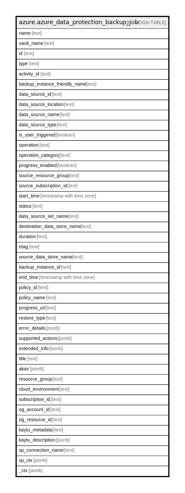

# azure.azure_data_protection_backup_job

## Description

Azure Data Protection Backup Job

## Columns

| Name | Type | Default | Nullable | Children | Parents | Comment |
| ---- | ---- | ------- | -------- | -------- | ------- | ------- |
| name | text |  | true |  |  | Resource name associated with the resource. |
| vault_name | text |  | true |  |  | The data protection vault name. |
| id | text |  | true |  |  | Resource ID represents the complete path to the resource. |
| type | text |  | true |  |  | Resource type represents the complete path of the form Namespace/ResourceType/ResourceType/... |
| activity_id | text |  | true |  |  | Job Activity Id. |
| backup_instance_friendly_name | text |  | true |  |  | Name of the Backup Instance. |
| data_source_id | text |  | true |  |  | ARM ID of the DataSource. |
| data_source_location | text |  | true |  |  | Location of the DataSource. |
| data_source_name | text |  | true |  |  | User Friendly Name of the DataSource. |
| data_source_type | text |  | true |  |  | Type of DataSource. |
| is_user_triggered | boolean |  | true |  |  | Indicates whether the job is adhoc(true) or scheduled(false). |
| operation | text |  | true |  |  | Type of Job i.e. Backup:full/log/diff ;Restore:ALR/OLR; Tiering:Backup/Archive ; Management:ConfigureProtection/UnConfigure. |
| operation_category | text |  | true |  |  | Indicates the type of Job i.e. Backup/Restore/Tiering/Management. |
| progress_enabled | boolean |  | true |  |  | Indicates whether progress is enabled for the job. |
| source_resource_group | text |  | true |  |  | Resource Group Name of the Datasource. |
| source_subscription_id | text |  | true |  |  | SubscriptionId corresponding to the DataSource. |
| start_time | timestamp with time zone |  | true |  |  | StartTime of the job (in UTC). |
| status | text |  | true |  |  | Status of the job like InProgress/Success/Failed/Cancelled/SuccessWithWarning. |
| data_source_set_name | text |  | true |  |  | Data Source Set Name of the DataSource. |
| destination_data_store_name | text |  | true |  |  | Destination Data Store Name. |
| duration | text |  | true |  |  | Total run time of the job. ISO 8601 format. |
| etag | text |  | true |  |  | An unique read-only string that changes whenever the resource is updated. |
| source_data_store_name | text |  | true |  |  | Source Data Store Name. |
| backup_instance_id | text |  | true |  |  | ARM ID of the Backup Instance. |
| end_time | timestamp with time zone |  | true |  |  | EndTime of the job (in UTC). |
| policy_id | text |  | true |  |  | ARM ID of the policy. |
| policy_name | text |  | true |  |  | Name of the policy. |
| progress_url | text |  | true |  |  | Url which contains job's progress. |
| restore_type | text |  | true |  |  | Indicates the sub type of operation i.e. in case of Restore it can be ALR/OLR. |
| error_details | jsonb |  | true |  |  | A List, detailing the errors related to the job. |
| supported_actions | jsonb |  | true |  |  | List of supported actions. |
| extended_info | jsonb |  | true |  |  | Extended Information about the job. |
| title | text |  | true |  |  | Title of the resource. |
| akas | jsonb |  | true |  |  | Array of globally unique identifier strings (also known as) for the resource. |
| resource_group | text |  | true |  |  | The resource group which holds this resource. |
| cloud_environment | text |  | true |  |  | The Azure Cloud Environment. |
| subscription_id | text |  | true |  |  | The Azure Subscription ID in which the resource is located. |
| og_account_id | text |  | true |  |  | The Platform Account ID in which the resource is located. |
| og_resource_id | text |  | true |  |  | The unique ID of the resource in opengovernance. |
| kaytu_metadata | text |  | true |  |  | Platform Metadata of the Azure resource. |
| kaytu_description | jsonb |  | true |  |  | The full model description of the resource |
| sp_connection_name | text |  | true |  |  | Steampipe connection name. |
| sp_ctx | jsonb |  | true |  |  | Steampipe context in JSON form. |
| _ctx | jsonb |  | true |  |  | Steampipe context in JSON form. |

## Relations

---

> Generated by [tbls](https://github.com/k1LoW/tbls)
