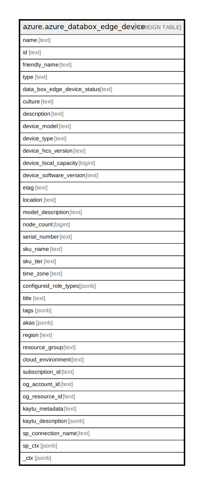

# azure.azure_databox_edge_device

## Description

Azure Data Box Edge Device

## Columns

| Name | Type | Default | Nullable | Children | Parents | Comment |
| ---- | ---- | ------- | -------- | -------- | ------- | ------- |
| name | text |  | true |  |  | The resource name. |
| id | text |  | true |  |  | The resource identifier. |
| friendly_name | text |  | true |  |  | The Data Box Edge/Gateway device name. |
| type | text |  | true |  |  | The resource type. |
| data_box_edge_device_status | text |  | true |  |  | The status of the Data Box Edge/Gateway device. Possible values include: 'ReadyToSetup', 'Online', 'Offline', 'NeedsAttention', 'Disconnected', 'PartiallyDisconnected', 'Maintenance'. |
| culture | text |  | true |  |  | The Data Box Edge/Gateway device culture. |
| description | text |  | true |  |  | he Description of the Data Box Edge/Gateway device. |
| device_model | text |  | true |  |  | The Data Box Edge/Gateway device model. |
| device_type | text |  | true |  |  | The type of the Data Box Edge/Gateway device. Possible values include: 'DataBoxEdgeDevice'. |
| device_hcs_version | text |  | true |  |  | The device software version number of the device (eg: 1.2.18105.6). |
| device_local_capacity | bigint |  | true |  |  | The Data Box Edge/Gateway device local capacity in MB. |
| device_software_version | text |  | true |  |  | The Data Box Edge/Gateway device software version. |
| etag | text |  | true |  |  | The etag for the devices. |
| location | text |  | true |  |  | The location of the device. This is a supported and registered Azure geographical region (for example, West US, East US, or Southeast Asia). The geographical region of a device cannot be changed once it is created, but if an identical geographical region is specified on update, the request will succeed. |
| model_description | text |  | true |  |  | The description of the Data Box Edge/Gateway device model. |
| node_count | bigint |  | true |  |  | The number of nodes in the cluster. |
| serial_number | text |  | true |  |  | The Serial Number of Data Box Edge/Gateway device. |
| sku_name | text |  | true |  |  | SKU name of the resource. Possible values include: 'Gateway', 'Edge'. |
| sku_tier | text |  | true |  |  | The SKU tier. This is based on the SKU name. Possible values include: 'Standard'. |
| time_zone | text |  | true |  |  | The Data Box Edge/Gateway device timezone. |
| configured_role_types | jsonb |  | true |  |  | Type of compute roles configured. |
| title | text |  | true |  |  | Title of the resource. |
| tags | jsonb |  | true |  |  | A map of tags for the resource. |
| akas | jsonb |  | true |  |  | Array of globally unique identifier strings (also known as) for the resource. |
| region | text |  | true |  |  | The Azure region/location in which the resource is located. |
| resource_group | text |  | true |  |  | The resource group which holds this resource. |
| cloud_environment | text |  | true |  |  | The Azure Cloud Environment. |
| subscription_id | text |  | true |  |  | The Azure Subscription ID in which the resource is located. |
| og_account_id | text |  | true |  |  | The Platform Account ID in which the resource is located. |
| og_resource_id | text |  | true |  |  | The unique ID of the resource in opengovernance. |
| kaytu_metadata | text |  | true |  |  | Platform Metadata of the Azure resource. |
| kaytu_description | jsonb |  | true |  |  | The full model description of the resource |
| sp_connection_name | text |  | true |  |  | Steampipe connection name. |
| sp_ctx | jsonb |  | true |  |  | Steampipe context in JSON form. |
| _ctx | jsonb |  | true |  |  | Steampipe context in JSON form. |

## Relations

---

> Generated by [tbls](https://github.com/k1LoW/tbls)
