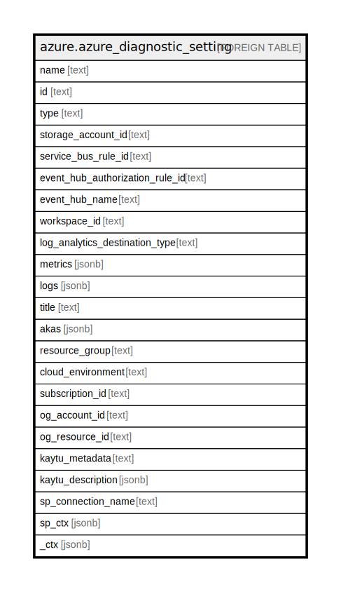

# azure.azure_diagnostic_setting

## Description

Azure Diagnostic Setting

## Columns

| Name | Type | Default | Nullable | Children | Parents | Comment |
| ---- | ---- | ------- | -------- | -------- | ------- | ------- |
| name | text |  | true |  |  | The name of the resource. |
| id | text |  | true |  |  | The resource Id. |
| type | text |  | true |  |  | Type of the resource. |
| storage_account_id | text |  | true |  |  | The resource ID of the storage account to which you would like to send Diagnostic Logs. |
| service_bus_rule_id | text |  | true |  |  | The service bus rule Id of the diagnostic setting. |
| event_hub_authorization_rule_id | text |  | true |  |  | The resource Id for the event hub authorization rule. |
| event_hub_name | text |  | true |  |  | The name of the event hub. |
| workspace_id | text |  | true |  |  | The full ARM resource ID of the Log Analytics workspace to which you would like to send Diagnostic Logs. |
| log_analytics_destination_type | text |  | true |  |  | A string indicating whether the export to Log Analytics should use the default destinatio type. |
| metrics | jsonb |  | true |  |  | The list of metric settings. |
| logs | jsonb |  | true |  |  | The list of logs settings. |
| title | text |  | true |  |  | Title of the resource. |
| akas | jsonb |  | true |  |  | Array of globally unique identifier strings (also known as) for the resource. |
| resource_group | text |  | true |  |  | The resource group which holds this resource. |
| cloud_environment | text |  | true |  |  | The Azure Cloud Environment. |
| subscription_id | text |  | true |  |  | The Azure Subscription ID in which the resource is located. |
| og_account_id | text |  | true |  |  | The Platform Account ID in which the resource is located. |
| og_resource_id | text |  | true |  |  | The unique ID of the resource in opengovernance. |
| kaytu_metadata | text |  | true |  |  | Platform Metadata of the Azure resource. |
| kaytu_description | jsonb |  | true |  |  | The full model description of the resource |
| sp_connection_name | text |  | true |  |  | Steampipe connection name. |
| sp_ctx | jsonb |  | true |  |  | Steampipe context in JSON form. |
| _ctx | jsonb |  | true |  |  | Steampipe context in JSON form. |

## Relations

---

> Generated by [tbls](https://github.com/k1LoW/tbls)
