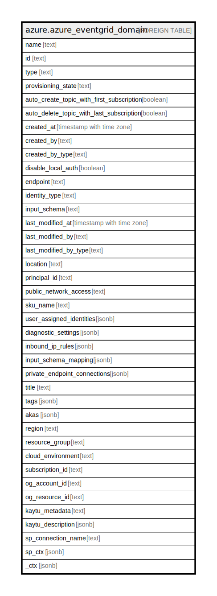

# azure.azure_eventgrid_domain

## Description

Azure Event Grid Domain

## Columns

| Name | Type | Default | Nullable | Children | Parents | Comment |
| ---- | ---- | ------- | -------- | -------- | ------- | ------- |
| name | text |  | true |  |  | The name of the resource. |
| id | text |  | true |  |  | Fully qualified identifier of the resource. |
| type | text |  | true |  |  | The resource type. |
| provisioning_state | text |  | true |  |  | Provisioning state of the event grid domain resource. Possible values include: 'Creating', 'Updating', 'Deleting', 'Succeeded', 'Canceled', 'Failed'. |
| auto_create_topic_with_first_subscription | boolean |  | true |  |  | This Boolean is used to specify the creation mechanism for 'all' the event grid domain topics associated with this event grid domain resource. |
| auto_delete_topic_with_last_subscription | boolean |  | true |  |  | This Boolean is used to specify the deletion mechanism for 'all' the Event Grid Domain Topics associated with this Event Grid Domain resource. |
| created_at | timestamp with time zone |  | true |  |  | The timestamp of resource creation (UTC). |
| created_by | text |  | true |  |  | The identity that created the resource. |
| created_by_type | text |  | true |  |  | The type of identity that created the resource. |
| disable_local_auth | boolean |  | true |  |  | This boolean is used to enable or disable local auth. Default value is false. When the property is set to true, only AAD token will be used to authenticate if user is allowed to publish to the domain. |
| endpoint | text |  | true |  |  | Endpoint for the Event Grid Domain Resource which is used for publishing the events. |
| identity_type | text |  | true |  |  | The type of managed identity used. The type 'SystemAssigned, UserAssigned' includes both an implicitly created identity and a set of user-assigned identities. The type 'None' will remove any identity. Possible values include: 'None', 'SystemAssigned', 'UserAssigned', 'SystemAssignedUserAssigned'. |
| input_schema | text |  | true |  |  | This determines the format that Event Grid should expect for incoming events published to the Event Grid Domain Resource. Possible values include: 'EventGridSchema', 'CustomEventSchema', 'CloudEventSchemaV10'. |
| last_modified_at | timestamp with time zone |  | true |  |  | The timestamp of resource last modification (UTC). |
| last_modified_by | text |  | true |  |  | The identity that last modified the resource. |
| last_modified_by_type | text |  | true |  |  | The type of identity that last modified the resource. |
| location | text |  | true |  |  | Location of the resource. |
| principal_id | text |  | true |  |  | The principal ID of resource identity. |
| public_network_access | text |  | true |  |  | This determines if traffic is allowed over public network. By default it is enabled. |
| sku_name | text |  | true |  |  | Name of this SKU. Possible values include: 'Basic', 'Standard'. |
| user_assigned_identities | jsonb |  | true |  |  | The list of user identities associated with the resource. The user identity dictionary key references will be ARM resource ids. |
| diagnostic_settings | jsonb |  | true |  |  | A list of active diagnostic settings for the eventgrid domain. |
| inbound_ip_rules | jsonb |  | true |  |  | This can be used to restrict traffic from specific IPs instead of all IPs. Note: These are considered only if PublicNetworkAccess is enabled. |
| input_schema_mapping | jsonb |  | true |  |  | Information about the InputSchemaMapping which specified the info about mapping event payload. |
| private_endpoint_connections | jsonb |  | true |  |  | List of private endpoint connections. |
| title | text |  | true |  |  | Title of the resource. |
| tags | jsonb |  | true |  |  | A map of tags for the resource. |
| akas | jsonb |  | true |  |  | Array of globally unique identifier strings (also known as) for the resource. |
| region | text |  | true |  |  | The Azure region/location in which the resource is located. |
| resource_group | text |  | true |  |  | The resource group which holds this resource. |
| cloud_environment | text |  | true |  |  | The Azure Cloud Environment. |
| subscription_id | text |  | true |  |  | The Azure Subscription ID in which the resource is located. |
| og_account_id | text |  | true |  |  | The Platform Account ID in which the resource is located. |
| og_resource_id | text |  | true |  |  | The unique ID of the resource in opengovernance. |
| kaytu_metadata | text |  | true |  |  | Platform Metadata of the Azure resource. |
| kaytu_description | jsonb |  | true |  |  | The full model description of the resource |
| sp_connection_name | text |  | true |  |  | Steampipe connection name. |
| sp_ctx | jsonb |  | true |  |  | Steampipe context in JSON form. |
| _ctx | jsonb |  | true |  |  | Steampipe context in JSON form. |

## Relations

---

> Generated by [tbls](https://github.com/k1LoW/tbls)
