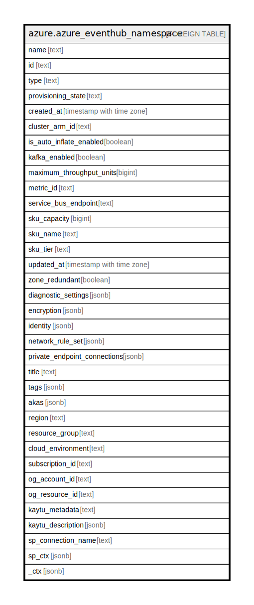

# azure.azure_eventhub_namespace

## Description

Azure Event Hub Namespace

## Columns

| Name | Type | Default | Nullable | Children | Parents | Comment |
| ---- | ---- | ------- | -------- | -------- | ------- | ------- |
| name | text |  | true |  |  | The name of the resource. |
| id | text |  | true |  |  | The ID of the resource. |
| type | text |  | true |  |  | The resource type. |
| provisioning_state | text |  | true |  |  | Provisioning state of the namespace. |
| created_at | timestamp with time zone |  | true |  |  | The time the namespace was created. |
| cluster_arm_id | text |  | true |  |  | Cluster ARM ID of the namespace. |
| is_auto_inflate_enabled | boolean |  | true |  |  | Indicates whether auto-inflate is enabled for eventhub namespace. |
| kafka_enabled | boolean |  | true |  |  | Indicates whether kafka is enabled for eventhub namespace, or not. |
| maximum_throughput_units | bigint |  | true |  |  | Upper limit of throughput units when auto-inflate is enabled, value should be within 0 to 20 throughput units. |
| metric_id | text |  | true |  |  | Identifier for azure insights metrics. |
| service_bus_endpoint | text |  | true |  |  | Endpoint you can use to perform service bus operations. |
| sku_capacity | bigint |  | true |  |  | The Event Hubs throughput units, value should be 0 to 20 throughput units. |
| sku_name | text |  | true |  |  | Name of this SKU. Possible values include: 'Basic', 'Standard'. |
| sku_tier | text |  | true |  |  | The billing tier of this particular SKU. Valid values are: 'Basic', 'Standard', 'Premium'. |
| updated_at | timestamp with time zone |  | true |  |  | The time the namespace was updated. |
| zone_redundant | boolean |  | true |  |  | Enabling this property creates a standard event hubs namespace in regions supported availability zones. |
| diagnostic_settings | jsonb |  | true |  |  | A list of active diagnostic settings for the eventhub namespace. |
| encryption | jsonb |  | true |  |  | Properties of BYOK encryption description. |
| identity | jsonb |  | true |  |  | Describes the properties of BYOK encryption description. |
| network_rule_set | jsonb |  | true |  |  | Describes the network rule set for specified namespace. The EventHub Namespace must be Premium in order to attach a EventHub Namespace Network Rule Set. |
| private_endpoint_connections | jsonb |  | true |  |  | The private endpoint connections of the namespace. |
| title | text |  | true |  |  | Title of the resource. |
| tags | jsonb |  | true |  |  | A map of tags for the resource. |
| akas | jsonb |  | true |  |  | Array of globally unique identifier strings (also known as) for the resource. |
| region | text |  | true |  |  | The Azure region/location in which the resource is located. |
| resource_group | text |  | true |  |  | The resource group which holds this resource. |
| cloud_environment | text |  | true |  |  | The Azure Cloud Environment. |
| subscription_id | text |  | true |  |  | The Azure Subscription ID in which the resource is located. |
| og_account_id | text |  | true |  |  | The Platform Account ID in which the resource is located. |
| og_resource_id | text |  | true |  |  | The unique ID of the resource in opengovernance. |
| kaytu_metadata | text |  | true |  |  | Platform Metadata of the Azure resource. |
| kaytu_description | jsonb |  | true |  |  | The full model description of the resource |
| sp_connection_name | text |  | true |  |  | Steampipe connection name. |
| sp_ctx | jsonb |  | true |  |  | Steampipe context in JSON form. |
| _ctx | jsonb |  | true |  |  | Steampipe context in JSON form. |

## Relations

---

> Generated by [tbls](https://github.com/k1LoW/tbls)
