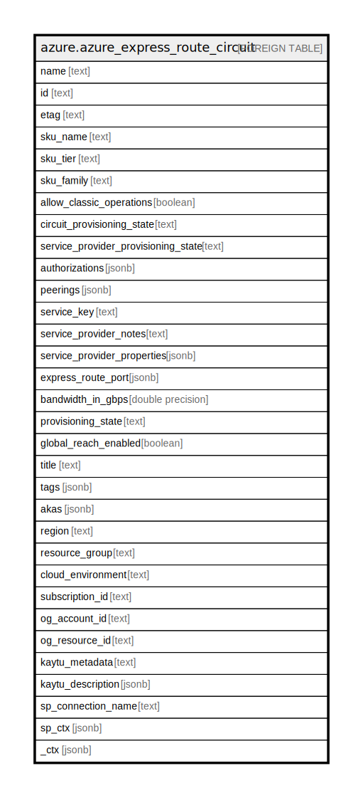

# azure.azure_express_route_circuit

## Description

Azure Express Route Circuit

## Columns

| Name | Type | Default | Nullable | Children | Parents | Comment |
| ---- | ---- | ------- | -------- | -------- | ------- | ------- |
| name | text |  | true |  |  | The friendly name that identifies the circuit. |
| id | text |  | true |  |  | Resource ID. |
| etag | text |  | true |  |  | An unique read-only string that changes whenever the resource is updated. |
| sku_name | text |  | true |  |  | The name of the SKU. |
| sku_tier | text |  | true |  |  | The tier of the SKU. Possible values include: 'Standard', 'Premium', 'Basic', 'Local'. |
| sku_family | text |  | true |  |  | The family of the SKU. Possible values include: 'UnlimitedData', 'MeteredData'. |
| allow_classic_operations | boolean |  | true |  |  | Allow classic operations. |
| circuit_provisioning_state | text |  | true |  |  | The CircuitProvisioningState state of the resource. |
| service_provider_provisioning_state | text |  | true |  |  | The ServiceProviderProvisioningState state of the resource. Possible values include: 'NotProvisioned', 'Provisioning', 'Provisioned', 'Deprovisioning'. |
| authorizations | jsonb |  | true |  |  | The list of authorizations. |
| peerings | jsonb |  | true |  |  | The list of peerings. |
| service_key | text |  | true |  |  | The ServiceKey. |
| service_provider_notes | text |  | true |  |  | The ServiceProviderNotes. |
| service_provider_properties | jsonb |  | true |  |  | The ServiceProviderProperties. |
| express_route_port | jsonb |  | true |  |  | The reference to the ExpressRoutePort resource when the circuit is provisioned on an ExpressRoutePort resource. |
| bandwidth_in_gbps | double precision |  | true |  |  | The bandwidth of the circuit when the circuit is provisioned on an ExpressRoutePort resource. |
| provisioning_state | text |  | true |  |  | The provisioning state of the express route circuit resource. Possible values include: 'Succeeded', 'Updating', 'Deleting', 'Failed'. |
| global_reach_enabled | boolean |  | true |  |  | Flag denoting global reach status. |
| title | text |  | true |  |  | Title of the resource. |
| tags | jsonb |  | true |  |  | A map of tags for the resource. |
| akas | jsonb |  | true |  |  | Array of globally unique identifier strings (also known as) for the resource. |
| region | text |  | true |  |  | The Azure region/location in which the resource is located. |
| resource_group | text |  | true |  |  | The resource group which holds this resource. |
| cloud_environment | text |  | true |  |  | The Azure Cloud Environment. |
| subscription_id | text |  | true |  |  | The Azure Subscription ID in which the resource is located. |
| og_account_id | text |  | true |  |  | The Platform Account ID in which the resource is located. |
| og_resource_id | text |  | true |  |  | The unique ID of the resource in opengovernance. |
| kaytu_metadata | text |  | true |  |  | Platform Metadata of the Azure resource. |
| kaytu_description | jsonb |  | true |  |  | The full model description of the resource |
| sp_connection_name | text |  | true |  |  | Steampipe connection name. |
| sp_ctx | jsonb |  | true |  |  | Steampipe context in JSON form. |
| _ctx | jsonb |  | true |  |  | Steampipe context in JSON form. |

## Relations

---

> Generated by [tbls](https://github.com/k1LoW/tbls)
