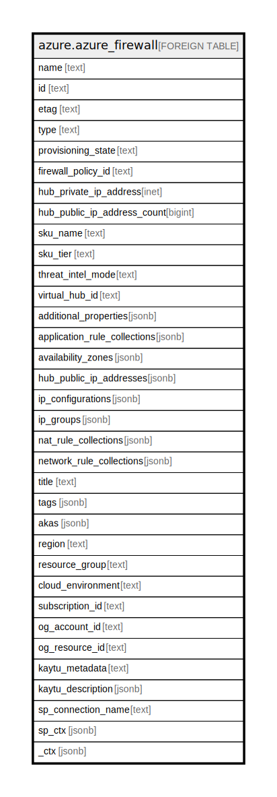

# azure.azure_firewall

## Description

Azure Firewall

## Columns

| Name | Type | Default | Nullable | Children | Parents | Comment |
| ---- | ---- | ------- | -------- | -------- | ------- | ------- |
| name | text |  | true |  |  | The friendly name that identifies the firewall |
| id | text |  | true |  |  | Contains ID to identify a firewall uniquely |
| etag | text |  | true |  |  | An unique read-only string that changes whenever the resource is updated |
| type | text |  | true |  |  | The resource type of the firewall |
| provisioning_state | text |  | true |  |  | The provisioning state of the firewall resource |
| firewall_policy_id | text |  | true |  |  | The firewallPolicy associated with this azure firewall |
| hub_private_ip_address | inet |  | true |  |  | Private IP Address associated with azure firewall |
| hub_public_ip_address_count | bigint |  | true |  |  | The number of Public IP addresses associated with azure firewall |
| sku_name | text |  | true |  |  | Name of an Azure Firewall SKU |
| sku_tier | text |  | true |  |  | Tier of an Azure Firewall |
| threat_intel_mode | text |  | true |  |  | The operation mode for Threat Intelligence |
| virtual_hub_id | text |  | true |  |  | The virtualHub to which the firewall belongs |
| additional_properties | jsonb |  | true |  |  | A collection of additional properties used to further config this azure firewall |
| application_rule_collections | jsonb |  | true |  |  | A collection of application rule collections used by Azure Firewall |
| availability_zones | jsonb |  | true |  |  | A collection of availability zones denoting where the resource needs to come from |
| hub_public_ip_addresses | jsonb |  | true |  |  | A collection of Public IP addresses associated with azure firewall or IP addresses to be retained |
| ip_configurations | jsonb |  | true |  |  | A collection of IP configuration of the Azure Firewall resource |
| ip_groups | jsonb |  | true |  |  | A collection of IpGroups associated with AzureFirewall |
| nat_rule_collections | jsonb |  | true |  |  | A collection of NAT rule collections used by Azure Firewall |
| network_rule_collections | jsonb |  | true |  |  | A collection of network rule collections used by Azure Firewall |
| title | text |  | true |  |  | Title of the resource. |
| tags | jsonb |  | true |  |  | A map of tags for the resource. |
| akas | jsonb |  | true |  |  | Array of globally unique identifier strings (also known as) for the resource. |
| region | text |  | true |  |  | The Azure region/location in which the resource is located. |
| resource_group | text |  | true |  |  | The resource group which holds this resource. |
| cloud_environment | text |  | true |  |  | The Azure Cloud Environment. |
| subscription_id | text |  | true |  |  | The Azure Subscription ID in which the resource is located. |
| og_account_id | text |  | true |  |  | The Platform Account ID in which the resource is located. |
| og_resource_id | text |  | true |  |  | The unique ID of the resource in opengovernance. |
| kaytu_metadata | text |  | true |  |  | Platform Metadata of the Azure resource. |
| kaytu_description | jsonb |  | true |  |  | The full model description of the resource |
| sp_connection_name | text |  | true |  |  | Steampipe connection name. |
| sp_ctx | jsonb |  | true |  |  | Steampipe context in JSON form. |
| _ctx | jsonb |  | true |  |  | Steampipe context in JSON form. |

## Relations

---

> Generated by [tbls](https://github.com/k1LoW/tbls)
