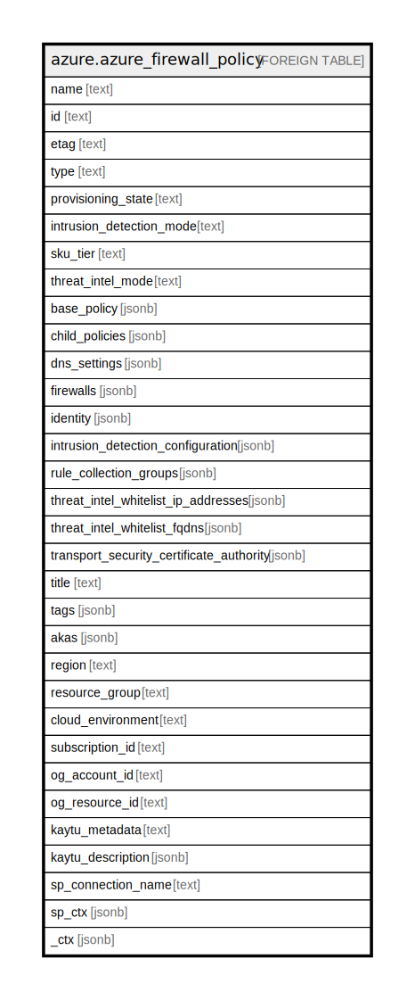

# azure.azure_firewall_policy

## Description

Azure Firewall Policy

## Columns

| Name | Type | Default | Nullable | Children | Parents | Comment |
| ---- | ---- | ------- | -------- | -------- | ------- | ------- |
| name | text |  | true |  |  | The friendly name that identifies the firewall policy. |
| id | text |  | true |  |  | Contains ID to identify a firewall policy uniquely. |
| etag | text |  | true |  |  | A unique read-only string that changes whenever the resource is updated. |
| type | text |  | true |  |  | The resource type of the firewall policy. |
| provisioning_state | text |  | true |  |  | The provisioning state of the firewall policy resource. Possible values include: 'Succeeded', 'Updating', 'Deleting', 'Failed'. |
| intrusion_detection_mode | text |  | true |  |  | Intrusion detection general state. Possible values include: 'FirewallPolicyIntrusionDetectionStateTypeOff', 'FirewallPolicyIntrusionDetectionStateTypeAlert', 'FirewallPolicyIntrusionDetectionStateTypeDeny'. |
| sku_tier | text |  | true |  |  | Tier of Firewall Policy. Possible values include: 'FirewallPolicySkuTierStandard', 'FirewallPolicySkuTierPremium'. |
| threat_intel_mode | text |  | true |  |  | The operation mode for Threat Intelligence. Possible values include: 'AzureFirewallThreatIntelModeAlert', 'AzureFirewallThreatIntelModeDeny', 'AzureFirewallThreatIntelModeOff'. |
| base_policy | jsonb |  | true |  |  | The parent firewall policy from which rules are inherited. |
| child_policies | jsonb |  | true |  |  | List of references to Child Firewall Policies. |
| dns_settings | jsonb |  | true |  |  | DNS Proxy Settings definition. |
| firewalls | jsonb |  | true |  |  | List of references to Azure Firewalls that this Firewall Policy is associated with. |
| identity | jsonb |  | true |  |  | The identity of the firewall policy. |
| intrusion_detection_configuration | jsonb |  | true |  |  | Intrusion detection configuration properties. |
| rule_collection_groups | jsonb |  | true |  |  | List of references to FirewallPolicyRuleCollectionGroups. |
| threat_intel_whitelist_ip_addresses | jsonb |  | true |  |  | List of IP addresses for the ThreatIntel Whitelist. |
| threat_intel_whitelist_fqdns | jsonb |  | true |  |  | List of FQDNs for the ThreatIntel Whitelist. |
| transport_security_certificate_authority | jsonb |  | true |  |  | The CA used for intermediate CA generation. |
| title | text |  | true |  |  | Title of the resource. |
| tags | jsonb |  | true |  |  | A map of tags for the resource. |
| akas | jsonb |  | true |  |  | Array of globally unique identifier strings (also known as) for the resource. |
| region | text |  | true |  |  | The Azure region/location in which the resource is located. |
| resource_group | text |  | true |  |  | The resource group which holds this resource. |
| cloud_environment | text |  | true |  |  | The Azure Cloud Environment. |
| subscription_id | text |  | true |  |  | The Azure Subscription ID in which the resource is located. |
| og_account_id | text |  | true |  |  | The Platform Account ID in which the resource is located. |
| og_resource_id | text |  | true |  |  | The unique ID of the resource in opengovernance. |
| kaytu_metadata | text |  | true |  |  | Platform Metadata of the Azure resource. |
| kaytu_description | jsonb |  | true |  |  | The full model description of the resource |
| sp_connection_name | text |  | true |  |  | Steampipe connection name. |
| sp_ctx | jsonb |  | true |  |  | Steampipe context in JSON form. |
| _ctx | jsonb |  | true |  |  | Steampipe context in JSON form. |

## Relations

---

> Generated by [tbls](https://github.com/k1LoW/tbls)
