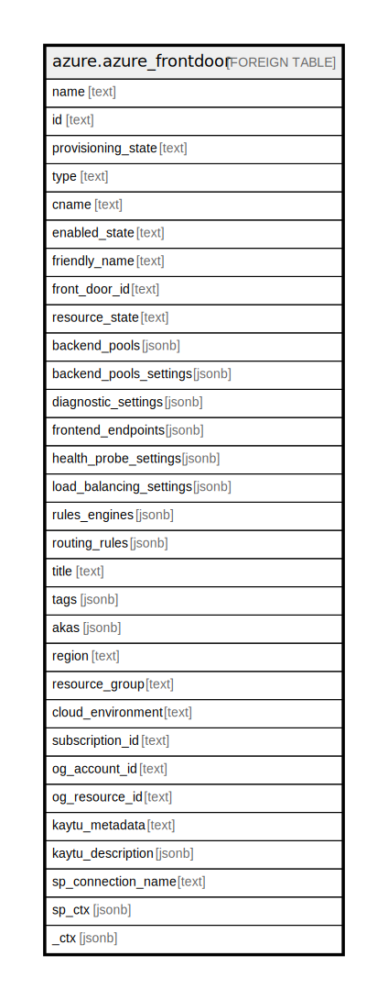

# azure.azure_frontdoor

## Description

Azure Front Door

## Columns

| Name | Type | Default | Nullable | Children | Parents | Comment |
| ---- | ---- | ------- | -------- | -------- | ------- | ------- |
| name | text |  | true |  |  | The name of the resource. |
| id | text |  | true |  |  | Fully qualified resource ID for the resource. |
| provisioning_state | text |  | true |  |  | Provisioning state of the front door. |
| type | text |  | true |  |  | The type of the resource. |
| cname | text |  | true |  |  | The host that each frontendEndpoint must CNAME to. |
| enabled_state | text |  | true |  |  | Operational status of the front door load balancer. Possible values include: 'Enabled', 'Disabled'. |
| friendly_name | text |  | true |  |  | A friendly name for the front door. |
| front_door_id | text |  | true |  |  | The ID of the front door. |
| resource_state | text |  | true |  |  | Resource status of the front door. Possible values include: 'Creating', 'Enabling', 'Enabled', 'Disabling', 'Disabled', 'Deleting'. |
| backend_pools | jsonb |  | true |  |  | Backend pools available to routing rules. |
| backend_pools_settings | jsonb |  | true |  |  | Settings for all backend pools |
| diagnostic_settings | jsonb |  | true |  |  | A list of active diagnostic settings for the resource. |
| frontend_endpoints | jsonb |  | true |  |  | Frontend endpoints available to routing rules. |
| health_probe_settings | jsonb |  | true |  |  | Health probe settings associated with this Front Door instance. |
| load_balancing_settings | jsonb |  | true |  |  | Load balancing settings associated with this front door instance. |
| rules_engines | jsonb |  | true |  |  | Rules engine configurations available to routing rules. |
| routing_rules | jsonb |  | true |  |  | Routing rules associated with this front door. |
| title | text |  | true |  |  | Title of the resource. |
| tags | jsonb |  | true |  |  | A map of tags for the resource. |
| akas | jsonb |  | true |  |  | Array of globally unique identifier strings (also known as) for the resource. |
| region | text |  | true |  |  | The Azure region/location in which the resource is located. |
| resource_group | text |  | true |  |  | The resource group which holds this resource. |
| cloud_environment | text |  | true |  |  | The Azure Cloud Environment. |
| subscription_id | text |  | true |  |  | The Azure Subscription ID in which the resource is located. |
| og_account_id | text |  | true |  |  | The Platform Account ID in which the resource is located. |
| og_resource_id | text |  | true |  |  | The unique ID of the resource in opengovernance. |
| kaytu_metadata | text |  | true |  |  | Platform Metadata of the Azure resource. |
| kaytu_description | jsonb |  | true |  |  | The full model description of the resource |
| sp_connection_name | text |  | true |  |  | Steampipe connection name. |
| sp_ctx | jsonb |  | true |  |  | Steampipe context in JSON form. |
| _ctx | jsonb |  | true |  |  | Steampipe context in JSON form. |

## Relations

---

> Generated by [tbls](https://github.com/k1LoW/tbls)
