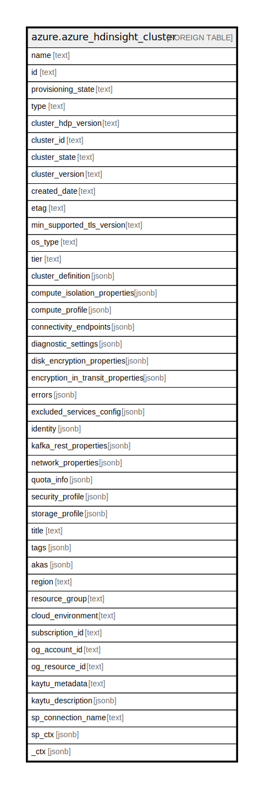

# azure.azure_hdinsight_cluster

## Description

Azure HDInsight Cluster

## Columns

| Name | Type | Default | Nullable | Children | Parents | Comment |
| ---- | ---- | ------- | -------- | -------- | ------- | ------- |
| name | text |  | true |  |  | The name of the resource. |
| id | text |  | true |  |  | Fully qualified resource Id for the resource. |
| provisioning_state | text |  | true |  |  | The provisioning state, which only appears in the response. Possible values include: 'InProgress', 'Failed', 'Succeeded', 'Canceled', 'Deleting'. |
| type | text |  | true |  |  | The type of the resource. |
| cluster_hdp_version | text |  | true |  |  | The hdp version of the cluster. |
| cluster_id | text |  | true |  |  | The cluster id. |
| cluster_state | text |  | true |  |  | The state of the cluster. |
| cluster_version | text |  | true |  |  | The version of the cluster. |
| created_date | text |  | true |  |  | The date on which the cluster was created. |
| etag | text |  | true |  |  | The ETag for the resource. |
| min_supported_tls_version | text |  | true |  |  | The minimal supported tls version of the cluster. |
| os_type | text |  | true |  |  | The type of operating system. Possible values include: 'Windows', 'Linux'. |
| tier | text |  | true |  |  | The cluster tier. Possible values include: 'Standard', 'Premium'. |
| cluster_definition | jsonb |  | true |  |  | The cluster definition. |
| compute_isolation_properties | jsonb |  | true |  |  | The compute isolation properties of the cluster. |
| compute_profile | jsonb |  | true |  |  | The complete profile of the cluster. |
| connectivity_endpoints | jsonb |  | true |  |  | The list of connectivity endpoints. |
| diagnostic_settings | jsonb |  | true |  |  | A list of active diagnostic settings for the cluster. |
| disk_encryption_properties | jsonb |  | true |  |  | The disk encryption properties of the cluster. |
| encryption_in_transit_properties | jsonb |  | true |  |  | The encryption-in-transit properties of the cluster. |
| errors | jsonb |  | true |  |  | The list of errors. |
| excluded_services_config | jsonb |  | true |  |  | The excluded services config of the cluster. |
| identity | jsonb |  | true |  |  | The identity of the cluster, if configured. |
| kafka_rest_properties | jsonb |  | true |  |  | The cluster kafka rest proxy configuration. |
| network_properties | jsonb |  | true |  |  | The network properties of the cluster. |
| quota_info | jsonb |  | true |  |  | The quota information of the cluster. |
| security_profile | jsonb |  | true |  |  | The security profile of the cluster. |
| storage_profile | jsonb |  | true |  |  | The storage profile of the cluster. |
| title | text |  | true |  |  | Title of the resource. |
| tags | jsonb |  | true |  |  | A map of tags for the resource. |
| akas | jsonb |  | true |  |  | Array of globally unique identifier strings (also known as) for the resource. |
| region | text |  | true |  |  | The Azure region/location in which the resource is located. |
| resource_group | text |  | true |  |  | The resource group which holds this resource. |
| cloud_environment | text |  | true |  |  | The Azure Cloud Environment. |
| subscription_id | text |  | true |  |  | The Azure Subscription ID in which the resource is located. |
| og_account_id | text |  | true |  |  | The Platform Account ID in which the resource is located. |
| og_resource_id | text |  | true |  |  | The unique ID of the resource in opengovernance. |
| kaytu_metadata | text |  | true |  |  | Platform Metadata of the Azure resource. |
| kaytu_description | jsonb |  | true |  |  | The full model description of the resource |
| sp_connection_name | text |  | true |  |  | Steampipe connection name. |
| sp_ctx | jsonb |  | true |  |  | Steampipe context in JSON form. |
| _ctx | jsonb |  | true |  |  | Steampipe context in JSON form. |

## Relations

---

> Generated by [tbls](https://github.com/k1LoW/tbls)
