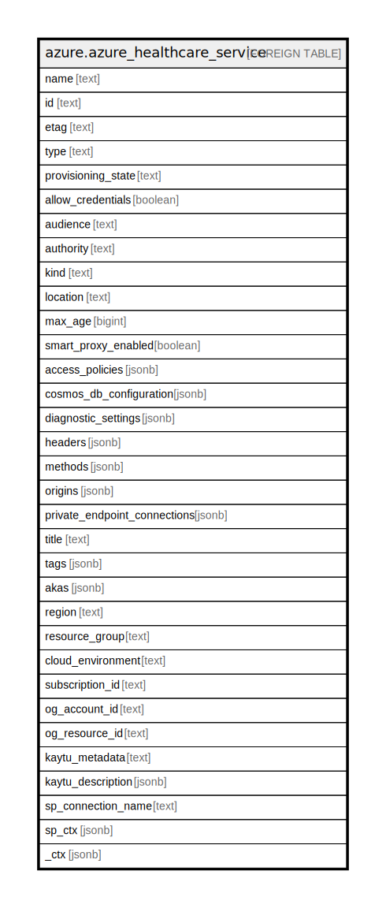

# azure.azure_healthcare_service

## Description

Azure Healthcare Service

## Columns

| Name | Type | Default | Nullable | Children | Parents | Comment |
| ---- | ---- | ------- | -------- | -------- | ------- | ------- |
| name | text |  | true |  |  | The resource name. |
| id | text |  | true |  |  | The resource identifier. |
| etag | text |  | true |  |  | An etag associated with the resource, used for optimistic concurrency when editing it. |
| type | text |  | true |  |  | The resource type. |
| provisioning_state | text |  | true |  |  | The provisioning state of the healthcare service resource. |
| allow_credentials | boolean |  | true |  |  | If credentials are allowed via CORS. |
| audience | text |  | true |  |  | The audience url for the service. |
| authority | text |  | true |  |  | The authority url for the service. |
| kind | text |  | true |  |  | The kind of the service. Possible values include: 'Fhir', 'FhirStu3', 'FhirR4'. |
| location | text |  | true |  |  | The resource location. |
| max_age | bigint |  | true |  |  | The max age to be allowed via CORS. |
| smart_proxy_enabled | boolean |  | true |  |  | If the SMART on FHIR proxy is enabled. |
| access_policies | jsonb |  | true |  |  | The access policies of the healthcare service. |
| cosmos_db_configuration | jsonb |  | true |  |  | The settings for the Cosmos DB database backing the service. |
| diagnostic_settings | jsonb |  | true |  |  | A list of active diagnostic settings for the healthcare serive. |
| headers | jsonb |  | true |  |  | The headers to be allowed via CORS. |
| methods | jsonb |  | true |  |  | The methods to be allowed via CORS. |
| origins | jsonb |  | true |  |  | The origins to be allowed via CORS. |
| private_endpoint_connections | jsonb |  | true |  |  | List of private endpoint connections for healthcare service. |
| title | text |  | true |  |  | Title of the resource. |
| tags | jsonb |  | true |  |  | A map of tags for the resource. |
| akas | jsonb |  | true |  |  | Array of globally unique identifier strings (also known as) for the resource. |
| region | text |  | true |  |  | The Azure region/location in which the resource is located. |
| resource_group | text |  | true |  |  | The resource group which holds this resource. |
| cloud_environment | text |  | true |  |  | The Azure Cloud Environment. |
| subscription_id | text |  | true |  |  | The Azure Subscription ID in which the resource is located. |
| og_account_id | text |  | true |  |  | The Platform Account ID in which the resource is located. |
| og_resource_id | text |  | true |  |  | The unique ID of the resource in opengovernance. |
| kaytu_metadata | text |  | true |  |  | Platform Metadata of the Azure resource. |
| kaytu_description | jsonb |  | true |  |  | The full model description of the resource |
| sp_connection_name | text |  | true |  |  | Steampipe connection name. |
| sp_ctx | jsonb |  | true |  |  | Steampipe context in JSON form. |
| _ctx | jsonb |  | true |  |  | Steampipe context in JSON form. |

## Relations

---

> Generated by [tbls](https://github.com/k1LoW/tbls)
