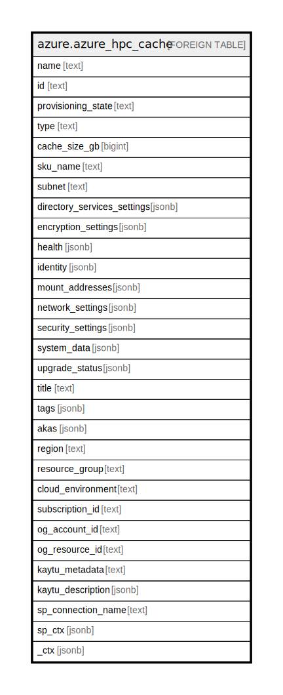

# azure.azure_hpc_cache

## Description

Azure HPC Cache

## Columns

| Name | Type | Default | Nullable | Children | Parents | Comment |
| ---- | ---- | ------- | -------- | -------- | ------- | ------- |
| name | text |  | true |  |  | The name of the cache. |
| id | text |  | true |  |  | The resource ID of the cache. |
| provisioning_state | text |  | true |  |  | ARM provisioning state. Possible values include: 'Succeeded', 'Failed', 'Cancelled', 'Creating', 'Deleting', 'Updating'. |
| type | text |  | true |  |  | The type of the cache. |
| cache_size_gb | bigint |  | true |  |  | The size of the cache, in GB. |
| sku_name | text |  | true |  |  | The SKU for the cache. |
| subnet | text |  | true |  |  | Subnet used for the cache. |
| directory_services_settings | jsonb |  | true |  |  | Specifies directory services settings of the cache. |
| encryption_settings | jsonb |  | true |  |  | Specifies encryption settings of the cache. |
| health | jsonb |  | true |  |  | The health of the cache. |
| identity | jsonb |  | true |  |  | The identity of the cache, if configured. |
| mount_addresses | jsonb |  | true |  |  | Array of IP addresses that can be used by clients mounting the cache. |
| network_settings | jsonb |  | true |  |  | Specifies network settings of the cache. |
| security_settings | jsonb |  | true |  |  | Specifies security settings of the cache. |
| system_data | jsonb |  | true |  |  | The system meta data relating to the resource. |
| upgrade_status | jsonb |  | true |  |  | Upgrade status of the cache. |
| title | text |  | true |  |  | Title of the resource. |
| tags | jsonb |  | true |  |  | A map of tags for the resource. |
| akas | jsonb |  | true |  |  | Array of globally unique identifier strings (also known as) for the resource. |
| region | text |  | true |  |  | The Azure region/location in which the resource is located. |
| resource_group | text |  | true |  |  | The resource group which holds this resource. |
| cloud_environment | text |  | true |  |  | The Azure Cloud Environment. |
| subscription_id | text |  | true |  |  | The Azure Subscription ID in which the resource is located. |
| og_account_id | text |  | true |  |  | The Platform Account ID in which the resource is located. |
| og_resource_id | text |  | true |  |  | The unique ID of the resource in opengovernance. |
| kaytu_metadata | text |  | true |  |  | Platform Metadata of the Azure resource. |
| kaytu_description | jsonb |  | true |  |  | The full model description of the resource |
| sp_connection_name | text |  | true |  |  | Steampipe connection name. |
| sp_ctx | jsonb |  | true |  |  | Steampipe context in JSON form. |
| _ctx | jsonb |  | true |  |  | Steampipe context in JSON form. |

## Relations

---

> Generated by [tbls](https://github.com/k1LoW/tbls)
