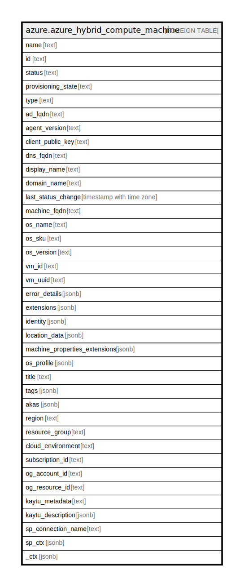

# azure.azure_hybrid_compute_machine

## Description

Azure Hybrid Compute Machine

## Columns

| Name | Type | Default | Nullable | Children | Parents | Comment |
| ---- | ---- | ------- | -------- | -------- | ------- | ------- |
| name | text |  | true |  |  | The name of the resource. |
| id | text |  | true |  |  | The resource ID. |
| status | text |  | true |  |  | The status of the hybrid machine agent. |
| provisioning_state | text |  | true |  |  | The provisioning state of the hybrid machine. |
| type | text |  | true |  |  | The type of the resource. |
| ad_fqdn | text |  | true |  |  | Specifies the AD fully qualified display name. |
| agent_version | text |  | true |  |  | The hybrid machine agent full version. |
| client_public_key | text |  | true |  |  | Public Key that the client provides to be used during initial resource onboarding. |
| dns_fqdn | text |  | true |  |  | Specifies the DNS fully qualified display name. |
| display_name | text |  | true |  |  | Specifies the hybrid machine display name. |
| domain_name | text |  | true |  |  | Specifies the Windows domain name. |
| last_status_change | timestamp with time zone |  | true |  |  | The time of the last status change. |
| machine_fqdn | text |  | true |  |  | Specifies the hybrid machine FQDN. |
| os_name | text |  | true |  |  | The Operating System running on the hybrid machine. |
| os_sku | text |  | true |  |  | Specifies the Operating System product SKU. |
| os_version | text |  | true |  |  | The version of Operating System running on the hybrid machine. |
| vm_id | text |  | true |  |  | Specifies the hybrid machine unique ID. |
| vm_uuid | text |  | true |  |  | Specifies the Arc Machine's unique SMBIOS ID. |
| error_details | jsonb |  | true |  |  | Details about the error state. |
| extensions | jsonb |  | true |  |  | The extensions of the compute machine. |
| identity | jsonb |  | true |  |  | The identity of the compute machine. |
| location_data | jsonb |  | true |  |  | The metadata pertaining to the geographic location of the resource. |
| machine_properties_extensions | jsonb |  | true |  |  | The machine properties extensions of the compute machine. |
| os_profile | jsonb |  | true |  |  | Specifies the operating system settings for the hybrid machine. |
| title | text |  | true |  |  | Title of the resource. |
| tags | jsonb |  | true |  |  | A map of tags for the resource. |
| akas | jsonb |  | true |  |  | Array of globally unique identifier strings (also known as) for the resource. |
| region | text |  | true |  |  | The Azure region/location in which the resource is located. |
| resource_group | text |  | true |  |  | The resource group which holds this resource. |
| cloud_environment | text |  | true |  |  | The Azure Cloud Environment. |
| subscription_id | text |  | true |  |  | The Azure Subscription ID in which the resource is located. |
| og_account_id | text |  | true |  |  | The Platform Account ID in which the resource is located. |
| og_resource_id | text |  | true |  |  | The unique ID of the resource in opengovernance. |
| kaytu_metadata | text |  | true |  |  | Platform Metadata of the Azure resource. |
| kaytu_description | jsonb |  | true |  |  | The full model description of the resource |
| sp_connection_name | text |  | true |  |  | Steampipe connection name. |
| sp_ctx | jsonb |  | true |  |  | Steampipe context in JSON form. |
| _ctx | jsonb |  | true |  |  | Steampipe context in JSON form. |

## Relations

---

> Generated by [tbls](https://github.com/k1LoW/tbls)
