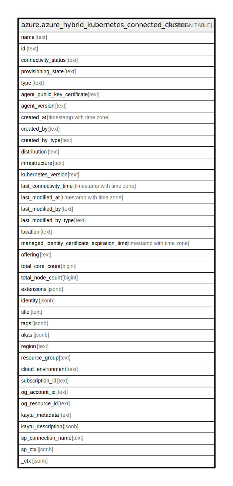

# azure.azure_hybrid_kubernetes_connected_cluster

## Description

Azure Hybrid Kubernetes Connected Cluster

## Columns

| Name | Type | Default | Nullable | Children | Parents | Comment |
| ---- | ---- | ------- | -------- | -------- | ------- | ------- |
| name | text |  | true |  |  | The name of the resource. |
| id | text |  | true |  |  | The resource ID. |
| connectivity_status | text |  | true |  |  | Represents the connectivity status of the connected cluster. |
| provisioning_state | text |  | true |  |  | The provisioning state of the connected cluster resource. |
| type | text |  | true |  |  | The type of the resource. |
| agent_public_key_certificate | text |  | true |  |  | Base64 encoded public certificate used by the agent to do the initial handshake to the backend services in Azure. |
| agent_version | text |  | true |  |  | Version of the agent running on the connected cluster resource. |
| created_at | timestamp with time zone |  | true |  |  | The timestamp of resource creation (UTC). |
| created_by | text |  | true |  |  | The identity that created the resource. |
| created_by_type | text |  | true |  |  | The type of identity that created the resource. |
| distribution | text |  | true |  |  | The Kubernetes distribution running on this connected cluster. |
| infrastructure | text |  | true |  |  | The infrastructure on which the Kubernetes cluster represented by this connected cluster is running on. |
| kubernetes_version | text |  | true |  |  | The Kubernetes version of the connected cluster resource. |
| last_connectivity_time | timestamp with time zone |  | true |  |  | Time representing the last instance when heart beat was received from the cluster. |
| last_modified_at | timestamp with time zone |  | true |  |  | The timestamp of resource last modification (UTC). |
| last_modified_by | text |  | true |  |  | The identity that last modified the resource. |
| last_modified_by_type | text |  | true |  |  | The type of identity that last modified the resource. |
| location | text |  | true |  |  | Location of the resource. |
| managed_identity_certificate_expiration_time | timestamp with time zone |  | true |  |  | Expiration time of the managed identity certificate. |
| offering | text |  | true |  |  | Connected cluster offering. |
| total_core_count | bigint |  | true |  |  | Number of CPU cores present in the connected cluster resource. |
| total_node_count | bigint |  | true |  |  | Number of nodes present in the connected cluster resource. |
| extensions | jsonb |  | true |  |  | The extensions of the connected cluster. |
| identity | jsonb |  | true |  |  | The identity of the connected cluster. |
| title | text |  | true |  |  | Title of the resource. |
| tags | jsonb |  | true |  |  | A map of tags for the resource. |
| akas | jsonb |  | true |  |  | Array of globally unique identifier strings (also known as) for the resource. |
| region | text |  | true |  |  | The Azure region/location in which the resource is located. |
| resource_group | text |  | true |  |  | The resource group which holds this resource. |
| cloud_environment | text |  | true |  |  | The Azure Cloud Environment. |
| subscription_id | text |  | true |  |  | The Azure Subscription ID in which the resource is located. |
| og_account_id | text |  | true |  |  | The Platform Account ID in which the resource is located. |
| og_resource_id | text |  | true |  |  | The unique ID of the resource in opengovernance. |
| kaytu_metadata | text |  | true |  |  | Platform Metadata of the Azure resource. |
| kaytu_description | jsonb |  | true |  |  | The full model description of the resource |
| sp_connection_name | text |  | true |  |  | Steampipe connection name. |
| sp_ctx | jsonb |  | true |  |  | Steampipe context in JSON form. |
| _ctx | jsonb |  | true |  |  | Steampipe context in JSON form. |

## Relations

---

> Generated by [tbls](https://github.com/k1LoW/tbls)
