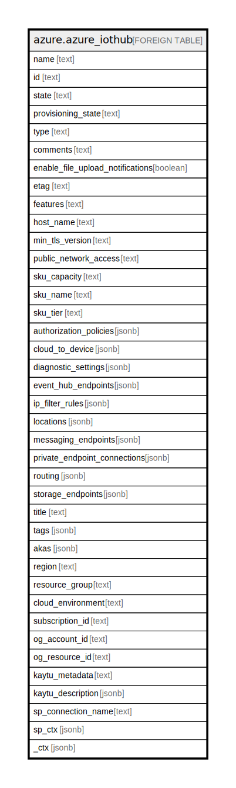

# azure.azure_iothub

## Description

Azure Iot Hub

## Columns

| Name | Type | Default | Nullable | Children | Parents | Comment |
| ---- | ---- | ------- | -------- | -------- | ------- | ------- |
| name | text |  | true |  |  | The resource name. |
| id | text |  | true |  |  | The resource identifier. |
| state | text |  | true |  |  | The iot hub state. |
| provisioning_state | text |  | true |  |  | The iot hub provisioning state. |
| type | text |  | true |  |  | The resource type. |
| comments | text |  | true |  |  | Iot hub comments. |
| enable_file_upload_notifications | boolean |  | true |  |  | Indicates if file upload notifications are enabled for the iot hub. |
| etag | text |  | true |  |  | An unique read-only string that changes whenever the resource is updated. |
| features | text |  | true |  |  | The capabilities and features enabled for the iot hub. Possible values include: 'None', 'DeviceManagement'. |
| host_name | text |  | true |  |  | The name of the host. |
| min_tls_version | text |  | true |  |  | Specifies the minimum TLS version to support for this iot hub. |
| public_network_access | text |  | true |  |  | Indicates whether requests from public network are allowed. |
| sku_capacity | text |  | true |  |  | Iot hub SKU capacity. |
| sku_name | text |  | true |  |  | Iot hub SKU name. |
| sku_tier | text |  | true |  |  | Iot hub SKU tier. |
| authorization_policies | jsonb |  | true |  |  | The shared access policies you can use to secure a connection to the iot hub. |
| cloud_to_device | jsonb |  | true |  |  | CloudToDevice properties of the iot hub. |
| diagnostic_settings | jsonb |  | true |  |  | A list of active diagnostic settings for the iot hub. |
| event_hub_endpoints | jsonb |  | true |  |  | The event hub-compatible endpoint properties. |
| ip_filter_rules | jsonb |  | true |  |  | The IP filter rules of the iot hub. |
| locations | jsonb |  | true |  |  | Primary and secondary location for iot hub. |
| messaging_endpoints | jsonb |  | true |  |  | The messaging endpoint properties for the file upload notification queue. |
| private_endpoint_connections | jsonb |  | true |  |  | Private endpoint connections created on this iot hub. |
| routing | jsonb |  | true |  |  | Routing properties of the iot hub. |
| storage_endpoints | jsonb |  | true |  |  | The list of azure storage endpoints where you can upload files. |
| title | text |  | true |  |  | Title of the resource. |
| tags | jsonb |  | true |  |  | A map of tags for the resource. |
| akas | jsonb |  | true |  |  | Array of globally unique identifier strings (also known as) for the resource. |
| region | text |  | true |  |  | The Azure region/location in which the resource is located. |
| resource_group | text |  | true |  |  | The resource group which holds this resource. |
| cloud_environment | text |  | true |  |  | The Azure Cloud Environment. |
| subscription_id | text |  | true |  |  | The Azure Subscription ID in which the resource is located. |
| og_account_id | text |  | true |  |  | The Platform Account ID in which the resource is located. |
| og_resource_id | text |  | true |  |  | The unique ID of the resource in opengovernance. |
| kaytu_metadata | text |  | true |  |  | Platform Metadata of the Azure resource. |
| kaytu_description | jsonb |  | true |  |  | The full model description of the resource |
| sp_connection_name | text |  | true |  |  | Steampipe connection name. |
| sp_ctx | jsonb |  | true |  |  | Steampipe context in JSON form. |
| _ctx | jsonb |  | true |  |  | Steampipe context in JSON form. |

## Relations

---

> Generated by [tbls](https://github.com/k1LoW/tbls)
