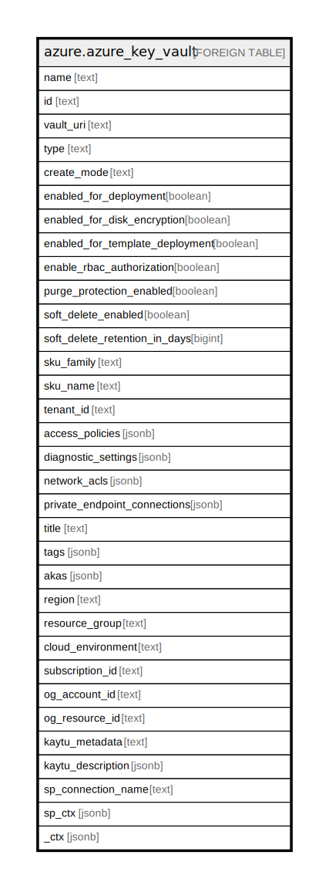

# azure.azure_key_vault

## Description

Azure Key Vault

## Columns

| Name | Type | Default | Nullable | Children | Parents | Comment |
| ---- | ---- | ------- | -------- | -------- | ------- | ------- |
| name | text |  | true |  |  | The friendly name that identifies the vault. |
| id | text |  | true |  |  | Contains ID to identify a vault uniquely. |
| vault_uri | text |  | true |  |  | Contains URI of the vault for performing operations on keys and secrets. |
| type | text |  | true |  |  | Type of the resource. |
| create_mode | text |  | true |  |  | The vault's create mode to indicate whether the vault need to be recovered or not. Possible values include: 'default', 'recover'. |
| enabled_for_deployment | boolean |  | true |  |  | Indicates whether Azure Virtual Machines are permitted to retrieve certificates stored as secrets from the key vault. |
| enabled_for_disk_encryption | boolean |  | true |  |  | Indicates whether Azure Disk Encryption is permitted to retrieve secrets from the vault and unwrap keys. |
| enabled_for_template_deployment | boolean |  | true |  |  | Indicates whether Azure Resource Manager is permitted to retrieve secrets from the key vault. |
| enable_rbac_authorization | boolean |  | true |  |  | Property that controls how data actions are authorized. |
| purge_protection_enabled | boolean |  | true |  |  | Indicates whether protection against purge is enabled for this vault. |
| soft_delete_enabled | boolean |  | true |  |  | Indicates whether the 'soft delete' functionality is enabled for this key vault. |
| soft_delete_retention_in_days | bigint |  | true |  |  | Contains softDelete data retention days. |
| sku_family | text |  | true |  |  | Contains SKU family name. |
| sku_name | text |  | true |  |  | SKU name to specify whether the key vault is a standard vault or a premium vault. |
| tenant_id | text |  | true |  |  | The Azure Active Directory tenant ID that should be used for authenticating requests to the key vault. |
| access_policies | jsonb |  | true |  |  | A list of 0 to 1024 identities that have access to the key vault. |
| diagnostic_settings | jsonb |  | true |  |  | A list of active diagnostic settings for the vault. |
| network_acls | jsonb |  | true |  |  | Rules governing the accessibility of the key vault from specific network locations. |
| private_endpoint_connections | jsonb |  | true |  |  | List of private endpoint connections associated with the key vault. |
| title | text |  | true |  |  | Title of the resource. |
| tags | jsonb |  | true |  |  | A map of tags for the resource. |
| akas | jsonb |  | true |  |  | Array of globally unique identifier strings (also known as) for the resource. |
| region | text |  | true |  |  | The Azure region/location in which the resource is located. |
| resource_group | text |  | true |  |  | The resource group which holds this resource. |
| cloud_environment | text |  | true |  |  | The Azure Cloud Environment. |
| subscription_id | text |  | true |  |  | The Azure Subscription ID in which the resource is located. |
| og_account_id | text |  | true |  |  | The Platform Account ID in which the resource is located. |
| og_resource_id | text |  | true |  |  | The unique ID of the resource in opengovernance. |
| kaytu_metadata | text |  | true |  |  | Platform Metadata of the Azure resource. |
| kaytu_description | jsonb |  | true |  |  | The full model description of the resource |
| sp_connection_name | text |  | true |  |  | Steampipe connection name. |
| sp_ctx | jsonb |  | true |  |  | Steampipe context in JSON form. |
| _ctx | jsonb |  | true |  |  | Steampipe context in JSON form. |

## Relations

---

> Generated by [tbls](https://github.com/k1LoW/tbls)
