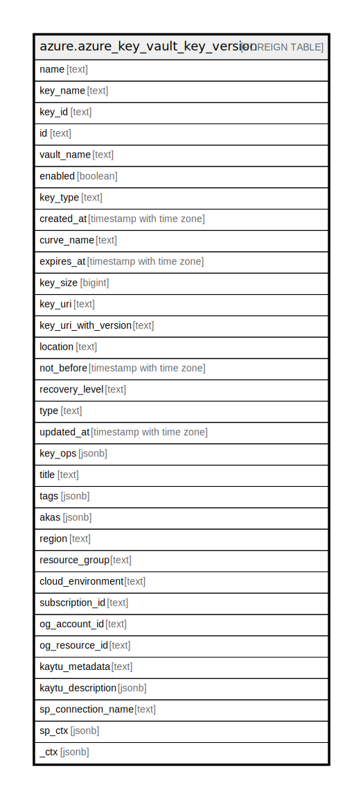

# azure.azure_key_vault_key_version

## Description

Azure Key Vault Key Version

## Columns

| Name | Type | Default | Nullable | Children | Parents | Comment |
| ---- | ---- | ------- | -------- | -------- | ------- | ------- |
| name | text |  | true |  |  | The friendly name that identifies the key version. |
| key_name | text |  | true |  |  | The friendly name that identifies the key. |
| key_id | text |  | true |  |  | Contains ID to identify a key uniquely. |
| id | text |  | true |  |  | Contains ID to identify a key version uniquely. |
| vault_name | text |  | true |  |  | The friendly name that identifies the vault. |
| enabled | boolean |  | true |  |  | Indicates whether the key version is enabled, or not. |
| key_type | text |  | true |  |  | The type of the key. Possible values are: 'EC', 'ECHSM', 'RSA', 'RSAHSM'. |
| created_at | timestamp with time zone |  | true |  |  | Specifies the time when the key version is created. |
| curve_name | text |  | true |  |  | The elliptic curve name. Possible values are: 'P256', 'P384', 'P521', 'P256K'. |
| expires_at | timestamp with time zone |  | true |  |  | Specifies the time when the key version wil expire. |
| key_size | bigint |  | true |  |  | The key size in bits. |
| key_uri | text |  | true |  |  | The URI to retrieve the current version of the key. |
| key_uri_with_version | text |  | true |  |  | The URI to retrieve the specific version of the key. |
| location | text |  | true |  |  | Azure location of the key vault resource. |
| not_before | timestamp with time zone |  | true |  |  | Specifies the time before which the key version is not usable. |
| recovery_level | text |  | true |  |  | The deletion recovery level currently in effect for the object. If it contains 'Purgeable', then the object can be permanently deleted by a privileged user; otherwise, only the system can purge the object at the end of the retention interval. |
| type | text |  | true |  |  | Type of the resource |
| updated_at | timestamp with time zone |  | true |  |  | Specifies the time when the key was last updated. |
| key_ops | jsonb |  | true |  |  | A list of key operations. |
| title | text |  | true |  |  | Title of the resource. |
| tags | jsonb |  | true |  |  | A map of tags for the resource. |
| akas | jsonb |  | true |  |  | Array of globally unique identifier strings (also known as) for the resource. |
| region | text |  | true |  |  | The Azure region/location in which the resource is located. |
| resource_group | text |  | true |  |  | The resource group which holds this resource. |
| cloud_environment | text |  | true |  |  | The Azure Cloud Environment. |
| subscription_id | text |  | true |  |  | The Azure Subscription ID in which the resource is located. |
| og_account_id | text |  | true |  |  | The Platform Account ID in which the resource is located. |
| og_resource_id | text |  | true |  |  | The unique ID of the resource in opengovernance. |
| kaytu_metadata | text |  | true |  |  | Platform Metadata of the Azure resource. |
| kaytu_description | jsonb |  | true |  |  | The full model description of the resource |
| sp_connection_name | text |  | true |  |  | Steampipe connection name. |
| sp_ctx | jsonb |  | true |  |  | Steampipe context in JSON form. |
| _ctx | jsonb |  | true |  |  | Steampipe context in JSON form. |

## Relations

---

> Generated by [tbls](https://github.com/k1LoW/tbls)
