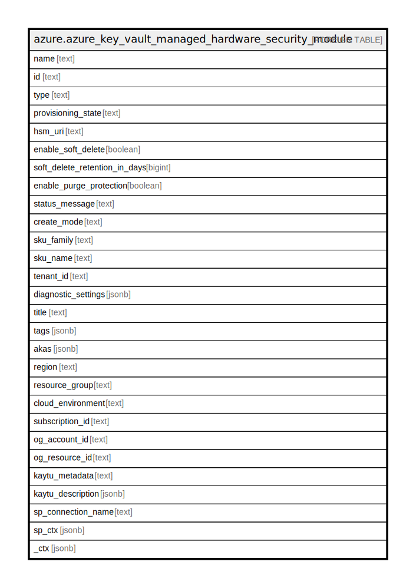

# azure.azure_key_vault_managed_hardware_security_module

## Description

Azure Key Vault Managed Hardware Security Module

## Columns

| Name | Type | Default | Nullable | Children | Parents | Comment |
| ---- | ---- | ------- | -------- | -------- | ------- | ------- |
| name | text |  | true |  |  | The name of the managed HSM Pool. |
| id | text |  | true |  |  | The Azure Resource Manager resource ID for the managed HSM Pool. |
| type | text |  | true |  |  | The resource type of the managed HSM Pool. |
| provisioning_state | text |  | true |  |  | Provisioning state. Possible values include: 'ProvisioningStateSucceeded', 'ProvisioningStateProvisioning', 'ProvisioningStateFailed', 'ProvisioningStateUpdating', 'ProvisioningStateDeleting', 'ProvisioningStateActivated', 'ProvisioningStateSecurityDomainRestore', 'ProvisioningStateRestoring'. |
| hsm_uri | text |  | true |  |  | The URI of the managed hsm pool for performing operations on keys. |
| enable_soft_delete | boolean |  | true |  |  | Property to specify whether the 'soft delete' functionality is enabled for this managed HSM pool. If it's not set to any value(true or false) when creating new managed HSM pool, it will be set to true by default. Once set to true, it cannot be reverted to false. |
| soft_delete_retention_in_days | bigint |  | true |  |  | Indicates softDelete data retention days. It accepts >=7 and <=90. |
| enable_purge_protection | boolean |  | true |  |  | Property specifying whether protection against purge is enabled for this managed HSM pool. Setting this property to true activates protection against purge for this managed HSM pool and its content - only the Managed HSM service may initiate a hard, irrecoverable deletion. The setting is effective only if soft delete is also enabled. Enabling this functionality is irreversible. |
| status_message | text |  | true |  |  | Resource Status Message. |
| create_mode | text |  | true |  |  | The create mode to indicate whether the resource is being created or is being recovered from a deleted resource. Possible values include: 'CreateModeRecover', 'CreateModeDefault'. |
| sku_family | text |  | true |  |  | Contains SKU family name. |
| sku_name | text |  | true |  |  | SKU name to specify whether the key vault is a standard vault or a premium vault. |
| tenant_id | text |  | true |  |  | The Azure Active Directory tenant ID that should be used for authenticating requests to the key vault. |
| diagnostic_settings | jsonb |  | true |  |  | A list of active diagnostic settings for the managed HSM. |
| title | text |  | true |  |  | Title of the resource. |
| tags | jsonb |  | true |  |  | A map of tags for the resource. |
| akas | jsonb |  | true |  |  | Array of globally unique identifier strings (also known as) for the resource. |
| region | text |  | true |  |  | The Azure region/location in which the resource is located. |
| resource_group | text |  | true |  |  | The resource group which holds this resource. |
| cloud_environment | text |  | true |  |  | The Azure Cloud Environment. |
| subscription_id | text |  | true |  |  | The Azure Subscription ID in which the resource is located. |
| og_account_id | text |  | true |  |  | The Platform Account ID in which the resource is located. |
| og_resource_id | text |  | true |  |  | The unique ID of the resource in opengovernance. |
| kaytu_metadata | text |  | true |  |  | Platform Metadata of the Azure resource. |
| kaytu_description | jsonb |  | true |  |  | The full model description of the resource |
| sp_connection_name | text |  | true |  |  | Steampipe connection name. |
| sp_ctx | jsonb |  | true |  |  | Steampipe context in JSON form. |
| _ctx | jsonb |  | true |  |  | Steampipe context in JSON form. |

## Relations

---

> Generated by [tbls](https://github.com/k1LoW/tbls)
