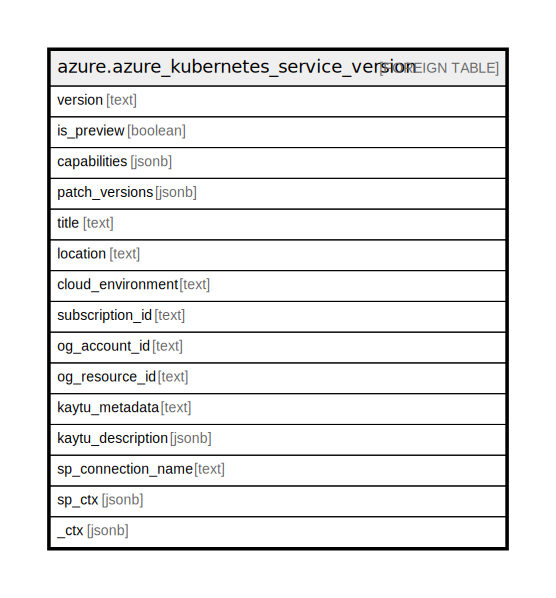

# azure.azure_kubernetes_service_version

## Description

Azure Kubernetes Service Version

## Columns

| Name | Type | Default | Nullable | Children | Parents | Comment |
| ---- | ---- | ------- | -------- | -------- | ------- | ------- |
| version | text |  | true |  |  | The major.minor version of Kubernetes release. |
| is_preview | boolean |  | true |  |  | Whether Kubernetes version is currently in preview. |
| capabilities | jsonb |  | true |  |  | Capabilities on this Kubernetes version. |
| patch_versions | jsonb |  | true |  |  | Patch versions of Kubernetes release. |
| title | text |  | true |  |  | Title of the resource. |
| location | text |  | true |  |  | The Azure region/location in which the resource is located. |
| cloud_environment | text |  | true |  |  | The Azure Cloud Environment. |
| subscription_id | text |  | true |  |  | The Azure Subscription ID in which the resource is located. |
| og_account_id | text |  | true |  |  | The Platform Account ID in which the resource is located. |
| og_resource_id | text |  | true |  |  | The unique ID of the resource in opengovernance. |
| kaytu_metadata | text |  | true |  |  | Platform Metadata of the Azure resource. |
| kaytu_description | jsonb |  | true |  |  | The full model description of the resource |
| sp_connection_name | text |  | true |  |  | Steampipe connection name. |
| sp_ctx | jsonb |  | true |  |  | Steampipe context in JSON form. |
| _ctx | jsonb |  | true |  |  | Steampipe context in JSON form. |

## Relations

---

> Generated by [tbls](https://github.com/k1LoW/tbls)
