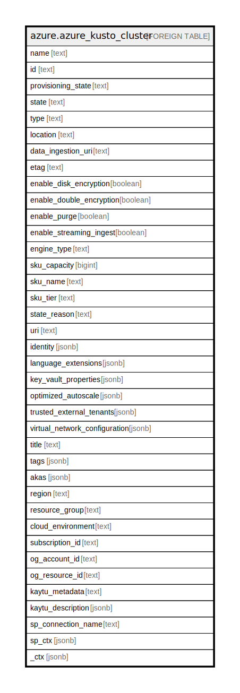

# azure.azure_kusto_cluster

## Description

Azure Kusto Cluster

## Columns

| Name | Type | Default | Nullable | Children | Parents | Comment |
| ---- | ---- | ------- | -------- | -------- | ------- | ------- |
| name | text |  | true |  |  | The name of the resource. |
| id | text |  | true |  |  | The resource Id. |
| provisioning_state | text |  | true |  |  | The provisioned state of the resource. Possible values include: 'Running', 'Creating', 'Deleting', 'Succeeded', 'Failed'. |
| state | text |  | true |  |  | The state of the resource. Possible values include: 'Creating', 'Deleted', 'Deleting', 'Running', 'Starting', 'Stopped', 'Stopping', 'Unavailable'. |
| type | text |  | true |  |  | Type of the resource. |
| location | text |  | true |  |  | Specifies the name of the region, the resource is created at. |
| data_ingestion_uri | text |  | true |  |  | The cluster data ingestion URI. |
| etag | text |  | true |  |  | An ETag of the resource created. |
| enable_disk_encryption | boolean |  | true |  |  | A boolean value that indicates if the cluster's disks are encrypted. |
| enable_double_encryption | boolean |  | true |  |  | A boolean value that indicates if double encryption is enabled. |
| enable_purge | boolean |  | true |  |  | A boolean value that indicates if the purge operations are enabled. |
| enable_streaming_ingest | boolean |  | true |  |  | A boolean value that indicates if the streaming ingest is enabled. |
| engine_type | text |  | true |  |  | The engine type. Possible values include: 'EngineTypeV2', 'EngineTypeV3'. |
| sku_capacity | bigint |  | true |  |  | SKU capacity of the resource. |
| sku_name | text |  | true |  |  | SKU name of the resource. Possible values include: 'KC8', 'KC16', 'KS8', 'KS16', 'D13V2', 'D14V2', 'L8', 'L16'. |
| sku_tier | text |  | true |  |  | SKU tier of the resource. |
| state_reason | text |  | true |  |  | SKU tier of the resource. |
| uri | text |  | true |  |  | The cluster URI. |
| identity | jsonb |  | true |  |  | The identity of the cluster, if configured. |
| language_extensions | jsonb |  | true |  |  | List of the cluster's language extensions. |
| key_vault_properties | jsonb |  | true |  |  | KeyVault properties for the cluster encryption. |
| optimized_autoscale | jsonb |  | true |  |  | Optimized auto scale definition. |
| trusted_external_tenants | jsonb |  | true |  |  | The cluster's external tenants. |
| virtual_network_configuration | jsonb |  | true |  |  | Virtual network definition of the resource. |
| title | text |  | true |  |  | Title of the resource. |
| tags | jsonb |  | true |  |  | A map of tags for the resource. |
| akas | jsonb |  | true |  |  | Array of globally unique identifier strings (also known as) for the resource. |
| region | text |  | true |  |  | The Azure region/location in which the resource is located. |
| resource_group | text |  | true |  |  | The resource group which holds this resource. |
| cloud_environment | text |  | true |  |  | The Azure Cloud Environment. |
| subscription_id | text |  | true |  |  | The Azure Subscription ID in which the resource is located. |
| og_account_id | text |  | true |  |  | The Platform Account ID in which the resource is located. |
| og_resource_id | text |  | true |  |  | The unique ID of the resource in opengovernance. |
| kaytu_metadata | text |  | true |  |  | Platform Metadata of the Azure resource. |
| kaytu_description | jsonb |  | true |  |  | The full model description of the resource |
| sp_connection_name | text |  | true |  |  | Steampipe connection name. |
| sp_ctx | jsonb |  | true |  |  | Steampipe context in JSON form. |
| _ctx | jsonb |  | true |  |  | Steampipe context in JSON form. |

## Relations

---

> Generated by [tbls](https://github.com/k1LoW/tbls)
