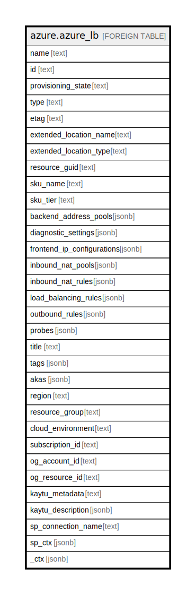

# azure.azure_lb

## Description

Azure Load Balancer

## Columns

| Name | Type | Default | Nullable | Children | Parents | Comment |
| ---- | ---- | ------- | -------- | -------- | ------- | ------- |
| name | text |  | true |  |  | The resource name. |
| id | text |  | true |  |  | The resource ID. |
| provisioning_state | text |  | true |  |  | The provisioning state of the load balancer resource. Possible values include: 'Succeeded', 'Updating', 'Deleting', 'Failed'. |
| type | text |  | true |  |  | The resource type. |
| etag | text |  | true |  |  | A unique read-only string that changes whenever the resource is updated. |
| extended_location_name | text |  | true |  |  | The name of the extended location. |
| extended_location_type | text |  | true |  |  | The type of the extended location. Possible values include: 'ExtendedLocationTypesEdgeZone'. |
| resource_guid | text |  | true |  |  | The resource GUID property of the load balancer resource. |
| sku_name | text |  | true |  |  | Name of the load balancer SKU. Possible values include: 'Basic', 'Standard', 'Gateway'. |
| sku_tier | text |  | true |  |  | Tier of the load balancer SKU. Possible values include: 'Regional', 'Global'. |
| backend_address_pools | jsonb |  | true |  |  | Collection of backend address pools used by the load balancer. |
| diagnostic_settings | jsonb |  | true |  |  | A list of active diagnostic settings for the load balancer. |
| frontend_ip_configurations | jsonb |  | true |  |  | Object representing the frontend IPs to be used for the load balancer. |
| inbound_nat_pools | jsonb |  | true |  |  | Defines an external port range for inbound NAT to a single backend port on NICs associated with the load balancer. Inbound NAT rules are created automatically for each NIC associated with the Load Balancer using an external port from this range. Defining an Inbound NAT pool on the Load Balancer is mutually exclusive with defining inbound Nat rules. Inbound NAT pools are referenced from virtual machine scale sets. NICs that are associated with individual virtual machines cannot reference an inbound NAT pool. They have to reference individual inbound NAT rules. |
| inbound_nat_rules | jsonb |  | true |  |  | Collection of inbound NAT Rules used by the load balancer. Defining inbound NAT rules on the load balancer is mutually exclusive with defining an inbound NAT pool. Inbound NAT pools are referenced from virtual machine scale sets. NICs that are associated with individual virtual machines cannot reference an Inbound NAT pool. They have to reference individual inbound NAT rules. |
| load_balancing_rules | jsonb |  | true |  |  | Object collection representing the load balancing rules Gets the provisioning. |
| outbound_rules | jsonb |  | true |  |  | The outbound rules. |
| probes | jsonb |  | true |  |  | Collection of probe objects used in the load balancer. |
| title | text |  | true |  |  | Title of the resource. |
| tags | jsonb |  | true |  |  | A map of tags for the resource. |
| akas | jsonb |  | true |  |  | Array of globally unique identifier strings (also known as) for the resource. |
| region | text |  | true |  |  | The Azure region/location in which the resource is located. |
| resource_group | text |  | true |  |  | The resource group which holds this resource. |
| cloud_environment | text |  | true |  |  | The Azure Cloud Environment. |
| subscription_id | text |  | true |  |  | The Azure Subscription ID in which the resource is located. |
| og_account_id | text |  | true |  |  | The Platform Account ID in which the resource is located. |
| og_resource_id | text |  | true |  |  | The unique ID of the resource in opengovernance. |
| kaytu_metadata | text |  | true |  |  | Platform Metadata of the Azure resource. |
| kaytu_description | jsonb |  | true |  |  | The full model description of the resource |
| sp_connection_name | text |  | true |  |  | Steampipe connection name. |
| sp_ctx | jsonb |  | true |  |  | Steampipe context in JSON form. |
| _ctx | jsonb |  | true |  |  | Steampipe context in JSON form. |

## Relations

---

> Generated by [tbls](https://github.com/k1LoW/tbls)
