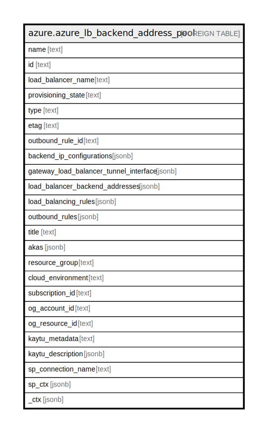

# azure.azure_lb_backend_address_pool

## Description

Azure Load Balancer Backend Address Pool

## Columns

| Name | Type | Default | Nullable | Children | Parents | Comment |
| ---- | ---- | ------- | -------- | -------- | ------- | ------- |
| name | text |  | true |  |  | The name of the resource that is unique within the set of backend address pools used by the load balancer. This name can be used to access the resource. |
| id | text |  | true |  |  | The resource ID. |
| load_balancer_name | text |  | true |  |  | The friendly name that identifies the load balancer. |
| provisioning_state | text |  | true |  |  | The provisioning state of the backend address pool resource. Possible values include: 'Succeeded', 'Updating', 'Deleting', 'Failed'. |
| type | text |  | true |  |  | Type of the resource. |
| etag | text |  | true |  |  | A unique read-only string that changes whenever the resource is updated. |
| outbound_rule_id | text |  | true |  |  | A reference to an outbound rule that uses this backend address pool. |
| backend_ip_configurations | jsonb |  | true |  |  | An array of references to IP addresses defined in network interfaces. |
| gateway_load_balancer_tunnel_interface | jsonb |  | true |  |  | An array of gateway load balancer tunnel interfaces. |
| load_balancer_backend_addresses | jsonb |  | true |  |  | An array of backend addresses. |
| load_balancing_rules | jsonb |  | true |  |  | An array of references to load balancing rules that use this backend address pool. |
| outbound_rules | jsonb |  | true |  |  | An array of references to outbound rules that use this backend address pool. |
| title | text |  | true |  |  | Title of the resource. |
| akas | jsonb |  | true |  |  | Array of globally unique identifier strings (also known as) for the resource. |
| resource_group | text |  | true |  |  | The resource group which holds this resource. |
| cloud_environment | text |  | true |  |  | The Azure Cloud Environment. |
| subscription_id | text |  | true |  |  | The Azure Subscription ID in which the resource is located. |
| og_account_id | text |  | true |  |  | The Platform Account ID in which the resource is located. |
| og_resource_id | text |  | true |  |  | The unique ID of the resource in opengovernance. |
| kaytu_metadata | text |  | true |  |  | Platform Metadata of the Azure resource. |
| kaytu_description | jsonb |  | true |  |  | The full model description of the resource |
| sp_connection_name | text |  | true |  |  | Steampipe connection name. |
| sp_ctx | jsonb |  | true |  |  | Steampipe context in JSON form. |
| _ctx | jsonb |  | true |  |  | Steampipe context in JSON form. |

## Relations

---

> Generated by [tbls](https://github.com/k1LoW/tbls)
