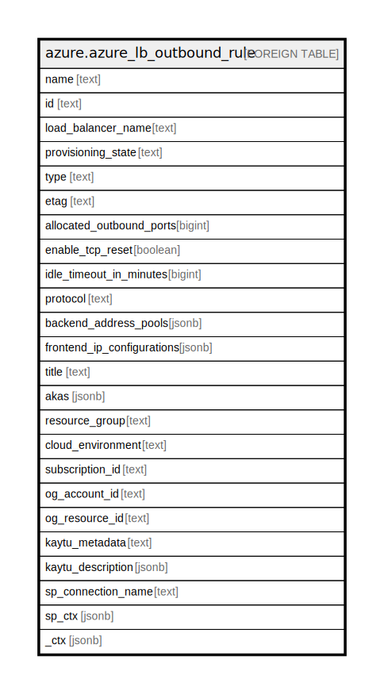

# azure.azure_lb_outbound_rule

## Description

Azure Load Balancer Outbound Rule

## Columns

| Name | Type | Default | Nullable | Children | Parents | Comment |
| ---- | ---- | ------- | -------- | -------- | ------- | ------- |
| name | text |  | true |  |  | The name of the resource that is unique within the set of outbound rules used by the load balancer. This name can be used to access the resource. |
| id | text |  | true |  |  | The resource ID. |
| load_balancer_name | text |  | true |  |  | The friendly name that identifies the load balancer. |
| provisioning_state | text |  | true |  |  | The provisioning state of the outbound rule resource. Possible values include: 'ProvisioningStateSucceeded', 'ProvisioningStateUpdating', 'ProvisioningStateDeleting', 'ProvisioningStateFailed'. |
| type | text |  | true |  |  | Type of the resource. |
| etag | text |  | true |  |  | A unique read-only string that changes whenever the resource is updated. |
| allocated_outbound_ports | bigint |  | true |  |  | The number of outbound ports to be used for NAT. |
| enable_tcp_reset | boolean |  | true |  |  | Receive bidirectional TCP Reset on TCP flow idle timeout or unexpected connection termination. This element is only used when the protocol is set to TCP. |
| idle_timeout_in_minutes | bigint |  | true |  |  | The timeout for the TCP idle connection. The value can be set between 4 and 30 minutes. The default value is 4 minutes. This element is only used when the protocol is set to TCP. |
| protocol | text |  | true |  |  | The protocol for the outbound rule in load balancer. Possible values include: 'LoadBalancerOutboundRuleProtocolTCP', 'LoadBalancerOutboundRuleProtocolUDP', 'LoadBalancerOutboundRuleProtocolAll'. |
| backend_address_pools | jsonb |  | true |  |  | A reference to a pool of DIPs. Outbound traffic is randomly load balanced across IPs in the backend IPs. |
| frontend_ip_configurations | jsonb |  | true |  |  | The Frontend IP addresses of the load balancer. |
| title | text |  | true |  |  | Title of the resource. |
| akas | jsonb |  | true |  |  | Array of globally unique identifier strings (also known as) for the resource. |
| resource_group | text |  | true |  |  | The resource group which holds this resource. |
| cloud_environment | text |  | true |  |  | The Azure Cloud Environment. |
| subscription_id | text |  | true |  |  | The Azure Subscription ID in which the resource is located. |
| og_account_id | text |  | true |  |  | The Platform Account ID in which the resource is located. |
| og_resource_id | text |  | true |  |  | The unique ID of the resource in opengovernance. |
| kaytu_metadata | text |  | true |  |  | Platform Metadata of the Azure resource. |
| kaytu_description | jsonb |  | true |  |  | The full model description of the resource |
| sp_connection_name | text |  | true |  |  | Steampipe connection name. |
| sp_ctx | jsonb |  | true |  |  | Steampipe context in JSON form. |
| _ctx | jsonb |  | true |  |  | Steampipe context in JSON form. |

## Relations

---

> Generated by [tbls](https://github.com/k1LoW/tbls)
