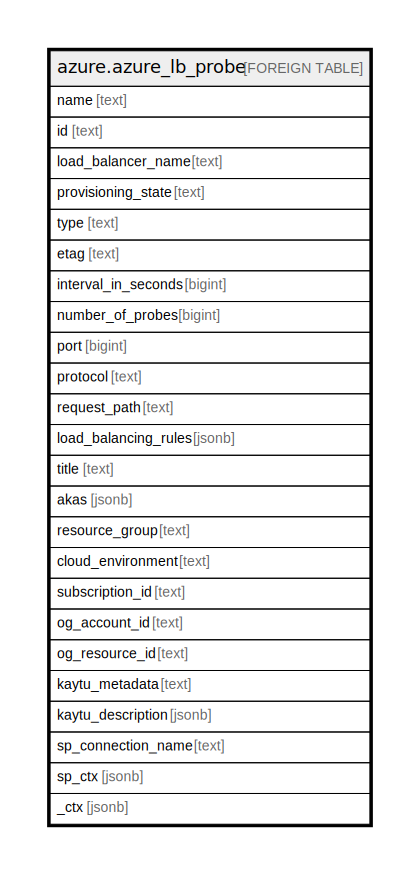

# azure.azure_lb_probe

## Description

Azure Load Balancer Probe

## Columns

| Name | Type | Default | Nullable | Children | Parents | Comment |
| ---- | ---- | ------- | -------- | -------- | ------- | ------- |
| name | text |  | true |  |  | The name of the resource that is unique within the set of probes used by the load balancer. This name can be used to access the resource. |
| id | text |  | true |  |  | The resource ID. |
| load_balancer_name | text |  | true |  |  | The friendly name that identifies the load balancer. |
| provisioning_state | text |  | true |  |  | The provisioning state of the probe resource. Possible values include: 'Succeeded', 'Updating', 'Deleting', 'Failed'. |
| type | text |  | true |  |  | Type of the resource. |
| etag | text |  | true |  |  | A unique read-only string that changes whenever the resource is updated. |
| interval_in_seconds | bigint |  | true |  |  | The interval, in seconds, for how frequently to probe the endpoint for health status. Typically, the interval is slightly less than half the allocated timeout period (in seconds) which allows two full probes before taking the instance out of rotation. The default value is 15, the minimum value is 5. |
| number_of_probes | bigint |  | true |  |  | The number of probes where if no response, will result in stopping further traffic from being delivered to the endpoint. This values allows endpoints to be taken out of rotation faster or slower than the typical times used in Azure. |
| port | bigint |  | true |  |  | The port for communicating the probe. Possible values range from 1 to 65535, inclusive. |
| protocol | text |  | true |  |  | The protocol of the end point. If 'Tcp' is specified, a received ACK is required for the probe to be successful. If 'Http' or 'Https' is specified, a 200 OK response from the specifies URI is required for the probe to be successful. Possible values include: 'HTTP', 'TCP', 'HTTPS'. |
| request_path | text |  | true |  |  | The URI used for requesting health status from the VM. Path is required if a protocol is set to http. Otherwise, it is not allowed. There is no default value. |
| load_balancing_rules | jsonb |  | true |  |  | The load balancer rules that use this probe. |
| title | text |  | true |  |  | Title of the resource. |
| akas | jsonb |  | true |  |  | Array of globally unique identifier strings (also known as) for the resource. |
| resource_group | text |  | true |  |  | The resource group which holds this resource. |
| cloud_environment | text |  | true |  |  | The Azure Cloud Environment. |
| subscription_id | text |  | true |  |  | The Azure Subscription ID in which the resource is located. |
| og_account_id | text |  | true |  |  | The Platform Account ID in which the resource is located. |
| og_resource_id | text |  | true |  |  | The unique ID of the resource in opengovernance. |
| kaytu_metadata | text |  | true |  |  | Platform Metadata of the Azure resource. |
| kaytu_description | jsonb |  | true |  |  | The full model description of the resource |
| sp_connection_name | text |  | true |  |  | Steampipe connection name. |
| sp_ctx | jsonb |  | true |  |  | Steampipe context in JSON form. |
| _ctx | jsonb |  | true |  |  | Steampipe context in JSON form. |

## Relations

---

> Generated by [tbls](https://github.com/k1LoW/tbls)
