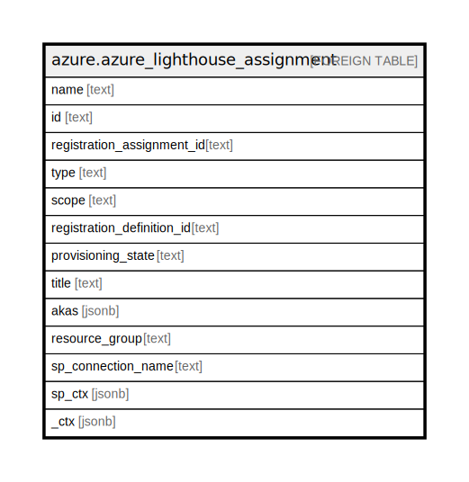

# azure.azure_lighthouse_assignment

## Description

Azure Lighthouse Assignment

## Columns

| Name | Type | Default | Nullable | Children | Parents | Comment |
| ---- | ---- | ------- | -------- | -------- | ------- | ------- |
| name | text |  | true |  |  | Name of the registration assignment. |
| id | text |  | true |  |  | Fully qualified path of the registration assignment. |
| registration_assignment_id | text |  | true |  |  | The ID of the registration assignment. |
| type | text |  | true |  |  | Type of the resource. |
| scope | text |  | true |  |  | The scope of the resource. |
| registration_definition_id | text |  | true |  |  | ID of the associated registration definition. |
| provisioning_state | text |  | true |  |  | Provisioning state of the registration assignment. |
| title | text |  | true |  |  | Title of the resource. |
| akas | jsonb |  | true |  |  | Array of globally unique identifier strings (also known as) for the resource. |
| resource_group | text |  | true |  |  | The resource group which holds this resource. |
| sp_connection_name | text |  | true |  |  | Steampipe connection name. |
| sp_ctx | jsonb |  | true |  |  | Steampipe context in JSON form. |
| _ctx | jsonb |  | true |  |  | Steampipe context in JSON form. |

## Relations

---

> Generated by [tbls](https://github.com/k1LoW/tbls)
