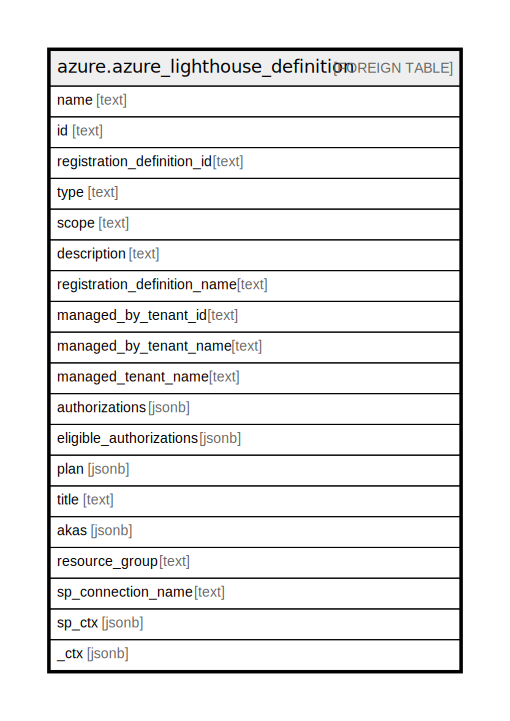

# azure.azure_lighthouse_definition

## Description

Azure Lighthouse Definition

## Columns

| Name | Type | Default | Nullable | Children | Parents | Comment |
| ---- | ---- | ------- | -------- | -------- | ------- | ------- |
| name | text |  | true |  |  | Name of the registration definition. |
| id | text |  | true |  |  | Fully qualified path of the registration definition. |
| registration_definition_id | text |  | true |  |  | The ID of the registration definition. |
| type | text |  | true |  |  | Type of the resource. |
| scope | text |  | true |  |  | The scope of the resource. |
| description | text |  | true |  |  | Description of the registration definition. |
| registration_definition_name | text |  | true |  |  | Name of the registration definition. |
| managed_by_tenant_id | text |  | true |  |  | ID of the managedBy tenant. |
| managed_by_tenant_name | text |  | true |  |  | The name of the managedBy tenant. |
| managed_tenant_name | text |  | true |  |  | The name of the managed tenant. |
| authorizations | jsonb |  | true |  |  | Authorization details containing principal ID and role ID. |
| eligible_authorizations | jsonb |  | true |  |  | The collection of eligible authorization objects describing the just-in-time access Azure Active Directory principals in the managedBy tenant will receive on the delegated resource in the managed tenant. |
| plan | jsonb |  | true |  |  | Plan details for the managed services. |
| title | text |  | true |  |  | Title of the resource. |
| akas | jsonb |  | true |  |  | Array of globally unique identifier strings (also known as) for the resource. |
| resource_group | text |  | true |  |  | The resource group which holds this resource. |
| sp_connection_name | text |  | true |  |  | Steampipe connection name. |
| sp_ctx | jsonb |  | true |  |  | Steampipe context in JSON form. |
| _ctx | jsonb |  | true |  |  | Steampipe context in JSON form. |

## Relations

---

> Generated by [tbls](https://github.com/k1LoW/tbls)
