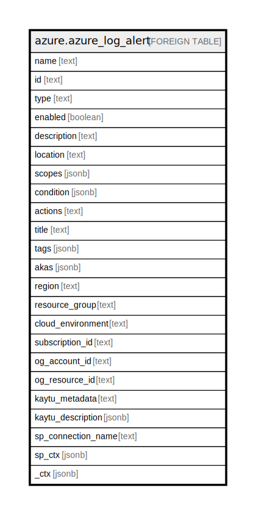

# azure.azure_log_alert

## Description

Azure Log Alert

## Columns

| Name | Type | Default | Nullable | Children | Parents | Comment |
| ---- | ---- | ------- | -------- | -------- | ------- | ------- |
| name | text |  | true |  |  | The name of the resource. |
| id | text |  | true |  |  | The resource Id. |
| type | text |  | true |  |  | Type of the resource |
| enabled | boolean |  | true |  |  | Indicates whether this activity log alert is enabled. |
| description | text |  | true |  |  | A description of this activity log alert. |
| location | text |  | true |  |  | The location of the resource. Since Azure Activity Log Alerts is a global service, the location of the rules should always be 'global'. |
| scopes | jsonb |  | true |  |  | A list of resourceIds that will be used as prefixes. |
| condition | jsonb |  | true |  |  | The condition that will cause this alert to activate. |
| actions | text |  | true |  |  | The actions that will activate when the condition is met. |
| title | text |  | true |  |  | Title of the resource. |
| tags | jsonb |  | true |  |  | A map of tags for the resource. |
| akas | jsonb |  | true |  |  | Array of globally unique identifier strings (also known as) for the resource. |
| region | text |  | true |  |  | The Azure region/location in which the resource is located. |
| resource_group | text |  | true |  |  | The resource group which holds this resource. |
| cloud_environment | text |  | true |  |  | The Azure Cloud Environment. |
| subscription_id | text |  | true |  |  | The Azure Subscription ID in which the resource is located. |
| og_account_id | text |  | true |  |  | The Platform Account ID in which the resource is located. |
| og_resource_id | text |  | true |  |  | The unique ID of the resource in opengovernance. |
| kaytu_metadata | text |  | true |  |  | Platform Metadata of the Azure resource. |
| kaytu_description | jsonb |  | true |  |  | The full model description of the resource |
| sp_connection_name | text |  | true |  |  | Steampipe connection name. |
| sp_ctx | jsonb |  | true |  |  | Steampipe context in JSON form. |
| _ctx | jsonb |  | true |  |  | Steampipe context in JSON form. |

## Relations

---

> Generated by [tbls](https://github.com/k1LoW/tbls)
