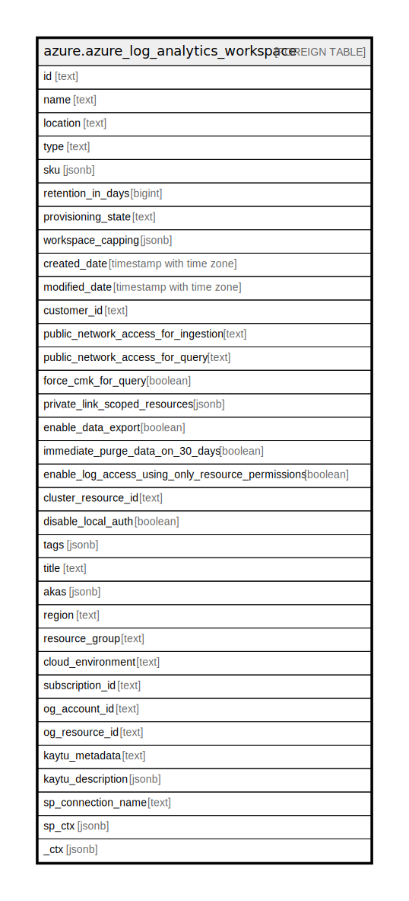

# azure.azure_log_analytics_workspace

## Description

Azure Log Analytics Workspace

## Columns

| Name | Type | Default | Nullable | Children | Parents | Comment |
| ---- | ---- | ------- | -------- | -------- | ------- | ------- |
| id | text |  | true |  |  | The id of the workspaces. |
| name | text |  | true |  |  | The name of the workspaces. |
| location | text |  | true |  |  | The location of the Log Analytics workspace. |
| type | text |  | true |  |  | The type of the Log Analytics workspace. |
| sku | jsonb |  | true |  |  | The SKU (pricing level) of the Log Analytics workspace. |
| retention_in_days | bigint |  | true |  |  | The retention period for the Log Analytics workspace data in days. |
| provisioning_state | text |  | true |  |  | The provisioning state of the Log Analytics workspace. |
| workspace_capping | jsonb |  | true |  |  | The workspace capping properties. |
| created_date | timestamp with time zone |  | true |  |  | Workspace creation date. |
| modified_date | timestamp with time zone |  | true |  |  | Workspace modification date. |
| customer_id | text |  | true |  |  | Represents the ID associated with the workspace. |
| public_network_access_for_ingestion | text |  | true |  |  | The network access type for accessing Log Analytics ingestion. |
| public_network_access_for_query | text |  | true |  |  | The network access type for accessing Log Analytics query. |
| force_cmk_for_query | boolean |  | true |  |  | Indicates whether customer managed storage is mandatory for query management. |
| private_link_scoped_resources | jsonb |  | true |  |  | List of linked private link scope resources. |
| enable_data_export | boolean |  | true |  |  | Flag that indicates if data should be exported. |
| immediate_purge_data_on_30_days | boolean |  | true |  |  | Flag that describes if we want to remove the data after 30 days. |
| enable_log_access_using_only_resource_permissions | boolean |  | true |  |  | Flag that indicates which permission to use - resource or workspace or both. |
| cluster_resource_id | text |  | true |  |  | Dedicated LA cluster resourceId that is linked to the workspaces. |
| disable_local_auth | boolean |  | true |  |  | Disable Non-AAD based Auth. |
| tags | jsonb |  | true |  |  | The tags assigned to the Log Analytics workspace. |
| title | text |  | true |  |  | Title of the resource. |
| akas | jsonb |  | true |  |  | Array of globally unique identifier strings (also known as) for the resource. |
| region | text |  | true |  |  | The region of the Log Analytics workspace. |
| resource_group | text |  | true |  |  | The resource group of the Log Analytics workspace. |
| cloud_environment | text |  | true |  |  | The Azure Cloud Environment. |
| subscription_id | text |  | true |  |  | The Azure Subscription ID in which the resource is located. |
| og_account_id | text |  | true |  |  | The Platform Account ID in which the resource is located. |
| og_resource_id | text |  | true |  |  | The unique ID of the resource in opengovernance. |
| kaytu_metadata | text |  | true |  |  | Platform Metadata of the Azure resource. |
| kaytu_description | jsonb |  | true |  |  | The full model description of the resource |
| sp_connection_name | text |  | true |  |  | Steampipe connection name. |
| sp_ctx | jsonb |  | true |  |  | Steampipe context in JSON form. |
| _ctx | jsonb |  | true |  |  | Steampipe context in JSON form. |

## Relations

---

> Generated by [tbls](https://github.com/k1LoW/tbls)
