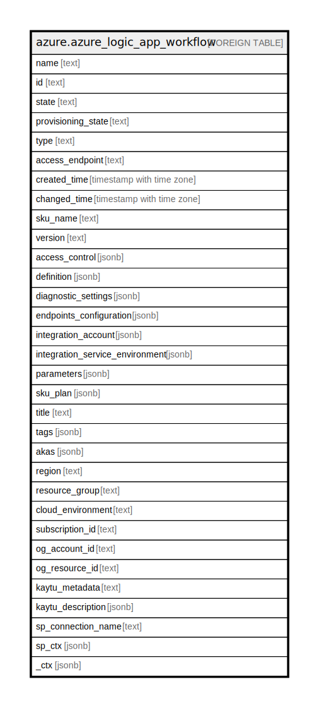

# azure.azure_logic_app_workflow

## Description

Azure Logic App Workflow

## Columns

| Name | Type | Default | Nullable | Children | Parents | Comment |
| ---- | ---- | ------- | -------- | -------- | ------- | ------- |
| name | text |  | true |  |  | The resource name. |
| id | text |  | true |  |  | The resource identifier. |
| state | text |  | true |  |  | The state of the workflow. |
| provisioning_state | text |  | true |  |  | The provisioning state of the workflow. |
| type | text |  | true |  |  | The resource type. |
| access_endpoint | text |  | true |  |  | The access endpoint of the workflow. |
| created_time | timestamp with time zone |  | true |  |  | The time when workflow was created. |
| changed_time | timestamp with time zone |  | true |  |  | Specifies the time, the workflow was updated. |
| sku_name | text |  | true |  |  | The sku name. |
| version | text |  | true |  |  | Version of the workflow. |
| access_control | jsonb |  | true |  |  | The access control configuration. |
| definition | jsonb |  | true |  |  | The workflow defination. |
| diagnostic_settings | jsonb |  | true |  |  | A list of active diagnostic settings for the workflow. |
| endpoints_configuration | jsonb |  | true |  |  | The endpoints configuration. |
| integration_account | jsonb |  | true |  |  | The integration account of the workflow. |
| integration_service_environment | jsonb |  | true |  |  | The integration service environment of the workflow. |
| parameters | jsonb |  | true |  |  | The workflow parameters. |
| sku_plan | jsonb |  | true |  |  | The sku Plan. |
| title | text |  | true |  |  | Title of the resource. |
| tags | jsonb |  | true |  |  | A map of tags for the resource. |
| akas | jsonb |  | true |  |  | Array of globally unique identifier strings (also known as) for the resource. |
| region | text |  | true |  |  | The Azure region/location in which the resource is located. |
| resource_group | text |  | true |  |  | The resource group which holds this resource. |
| cloud_environment | text |  | true |  |  | The Azure Cloud Environment. |
| subscription_id | text |  | true |  |  | The Azure Subscription ID in which the resource is located. |
| og_account_id | text |  | true |  |  | The Platform Account ID in which the resource is located. |
| og_resource_id | text |  | true |  |  | The unique ID of the resource in opengovernance. |
| kaytu_metadata | text |  | true |  |  | Platform Metadata of the Azure resource. |
| kaytu_description | jsonb |  | true |  |  | The full model description of the resource |
| sp_connection_name | text |  | true |  |  | Steampipe connection name. |
| sp_ctx | jsonb |  | true |  |  | Steampipe context in JSON form. |
| _ctx | jsonb |  | true |  |  | Steampipe context in JSON form. |

## Relations

---

> Generated by [tbls](https://github.com/k1LoW/tbls)
