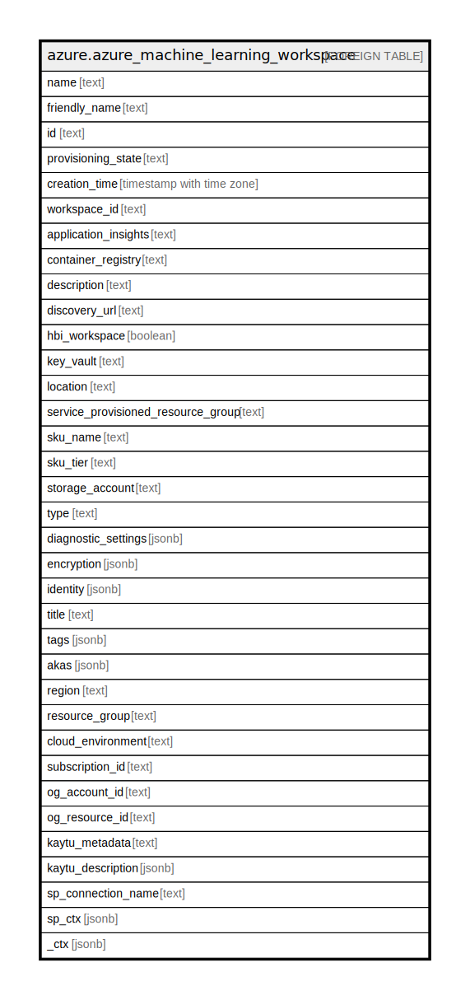

# azure.azure_machine_learning_workspace

## Description

Azure Machine Learning Workspace

## Columns

| Name | Type | Default | Nullable | Children | Parents | Comment |
| ---- | ---- | ------- | -------- | -------- | ------- | ------- |
| name | text |  | true |  |  | The resource name. |
| friendly_name | text |  | true |  |  | The friendly name for this workspace. This name in mutable. |
| id | text |  | true |  |  | The resource identifier. |
| provisioning_state | text |  | true |  |  | The current deployment state of workspace resource, The provisioningState is to indicate states for resource provisioning. Possible values include: 'Unknown', 'Updating', 'Creating', 'Deleting', 'Succeeded', 'Failed', 'Canceled'. |
| creation_time | timestamp with time zone |  | true |  |  | The creation time for this workspace resource. |
| workspace_id | text |  | true |  |  | The immutable id associated with this workspace. |
| application_insights | text |  | true |  |  | ARM id of the application insights associated with this workspace. This cannot be changed once the workspace has been created. |
| container_registry | text |  | true |  |  | ARM id of the container registry associated with this workspace. This cannot be changed once the workspace has been created. |
| description | text |  | true |  |  | The description of this workspace. |
| discovery_url | text |  | true |  |  | ARM id of the container registry associated with this workspace. This cannot be changed once the workspace has been created. |
| hbi_workspace | boolean |  | true |  |  | The flag to signal HBI data in the workspace and reduce diagnostic data collected by the service. |
| key_vault | text |  | true |  |  | ARM id of the key vault associated with this workspace, This cannot be changed once the workspace has been created. |
| location | text |  | true |  |  | The location of the resource. This cannot be changed after the resource is created. |
| service_provisioned_resource_group | text |  | true |  |  | The name of the managed resource group created by workspace RP in customer subscription if the workspace is CMK workspace. |
| sku_name | text |  | true |  |  | Name of the sku. |
| sku_tier | text |  | true |  |  | Tier of the sku like Basic or Enterprise. |
| storage_account | text |  | true |  |  | ARM id of the storage account associated with this workspace. This cannot be changed once the workspace has been created. |
| type | text |  | true |  |  | The resource type. |
| diagnostic_settings | jsonb |  | true |  |  | A list of active diagnostic settings for the azure ML workspace. |
| encryption | jsonb |  | true |  |  | The encryption settings of Azure ML workspace. |
| identity | jsonb |  | true |  |  | The identity of the resource. |
| title | text |  | true |  |  | Title of the resource. |
| tags | jsonb |  | true |  |  | A map of tags for the resource. |
| akas | jsonb |  | true |  |  | Array of globally unique identifier strings (also known as) for the resource. |
| region | text |  | true |  |  | The Azure region/location in which the resource is located. |
| resource_group | text |  | true |  |  | The resource group which holds this resource. |
| cloud_environment | text |  | true |  |  | The Azure Cloud Environment. |
| subscription_id | text |  | true |  |  | The Azure Subscription ID in which the resource is located. |
| og_account_id | text |  | true |  |  | The Platform Account ID in which the resource is located. |
| og_resource_id | text |  | true |  |  | The unique ID of the resource in opengovernance. |
| kaytu_metadata | text |  | true |  |  | Platform Metadata of the Azure resource. |
| kaytu_description | jsonb |  | true |  |  | The full model description of the resource |
| sp_connection_name | text |  | true |  |  | Steampipe connection name. |
| sp_ctx | jsonb |  | true |  |  | Steampipe context in JSON form. |
| _ctx | jsonb |  | true |  |  | Steampipe context in JSON form. |

## Relations

---

> Generated by [tbls](https://github.com/k1LoW/tbls)
